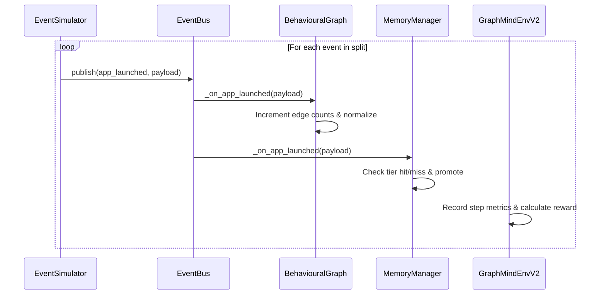

# GRAPHMIND V5

## 1. Executive Summary

* **What the project does**: GraphMind is an on-device, context-aware app prefetch and memory management engine designed for Android edge devices (such as Samsung smartphones). It constructs a weighted directed graph of user app usage patterns and uses a reinforcement learning (PPO) agent to dynamically adjust prefetching thresholds and budget allocations between memory tiers.
* **Primary users**: Samsung mobile device users running OneUI who require reduced app startup delays, smoother multitasking transitions, and improved resource utilization without relying on cloud computation.
* **Main business problem solved**: Android's default memory management is reactive, utilizing the Low Memory Killer Daemon (LMKD) to terminate background processes under memory pressure. When users relaunch these terminated apps, they face significant cold-start delays (typically ~1800ms). GraphMind proactively prewarms processes by preloading predicted apps into faster memory tiers, reducing launch latency down to hot/warm levels (45ms to 200ms).
* **Key capabilities**:
  * **Behavioral Transition Graph**: Captures transition sequences, frequency, and recency of app launches in a NetworkX directed digraph.
  * **Three-Tier Memory Management**: Simulates a memory hierarchy consisting of HOT (RAM, 0ms latency), WARM (fast preload cache, ~200ms latency), and COLD (persistent database, ~1800ms latency) tiers.
  * **Confidence Prefetch Scorer**: Evaluates next-app candidates using a frozen formula weighting transition probability (50%), historical frequency (40%), and recency decay (10%).
  * **Adaptive Reinforcement Learning (RL) Controller**: Uses a Gymnasium environment and a Stable-Baselines3 PPO model to adjust confidence thresholds and capacity allocations dynamically.
  * **Privacy Context Isolation**: Flushes sensitive categories (financial, health, enterprise) from memory when users transition to consumer applications.
  * **Post-Actuation Natural Language Explainability**: Integrates Google DeepMind's Gemma 2B model to generate friendly natural language explanations of prefetch decisions.

---

## 2. System Overview

### End-to-End Workflow
1. **Perception**: The user launches an app on their Android device. The ADB-based device collectors (or the event simulator in replay mode) capture the telemetry event.
2. **Dispatch**: The event is adapted to the GraphMind schema and published to the thread-safe global [EventBus](file:///c:/Users/dheer/OneDrive/Desktop/projects/Samsung/src/core/event_bus.py).
3. **Graph Update**: The [BehaviouralGraph](file:///c:/Users/dheer/OneDrive/Desktop/projects/Samsung/src/core/graph_engine.py) subscribes to the launch event, updates edge weights (incrementing transition counts by `0.01` and normalizing), and registers node statistics.
4. **Scoring & Prediction**: The [ConfidencePrefetch](file:///c:/Users/dheer/OneDrive/Desktop/projects/Samsung/src/prefetch/confidence_prefetch.py) scorer queries the graph for outgoing edges, computes combined confidence scores, and outputs a candidate list exceeding the active threshold.
5. **Actuation**: The [MemoryManager](file:///c:/Users/dheer/OneDrive/Desktop/projects/Samsung/src/core/memory_manager.py) assigns budget capacities based on the RL controller's state, promotes the launched app to the HOT tier, and rebuilds the WARM cache with predicted nodes.
6. **Adaptive Control**: The RL Gymnasium environment receives feedback from [RewardV2](file:///c:/Users/dheer/OneDrive/Desktop/projects/Samsung/src/rl/reward_v2.py) (weighing hit rate, latency saved, battery overhead, thrashing, and false positives) and steps the PPO model to adjust budgets and thresholds for the next cycle.
7. **Security Isolation**: The [ContextBoundaryEnforcer](file:///c:/Users/dheer/OneDrive/Desktop/projects/Samsung/src/security/context_boundary.py) checks if the transition crossed a sensitive-to-consumer boundary and flushes matching nodes from HOT/WARM cache.
8. **Explainability**: An asynchronous task queries [GemmaExplainer](file:///c:/Users/dheer/OneDrive/Desktop/projects/Samsung/src/gemma_explainer.py) to generate a friendly natural language explanation string for the prefetch action, saving a trace to the [DecisionTraceStore](file:///c:/Users/dheer/OneDrive/Desktop/projects/Samsung/src/explainability/decision_trace.py).

### Request Lifecycle
```
[User Action: Open App]
   │
   ▼
[Android Telemetry Collector]
   │
   ▼ (Payload: timestamp, user_id, app_id, category, battery, time_bucket)
[EventBus.publish()]
   │
   ├─► [BehaviouralGraph._on_app_launched()] ──► (Update Nodes/Edges)
   │
   ├─► [MemoryManager._on_app_launched()] ──────► (Verify Hit/Miss, Promote to HOT)
   │
   └─► [ContextBoundaryEnforcer._on_app_launched()] ──► (Check Sensitive Transition)
         │
         ▼ (If drop detected)
       [MemoryManager.flush_hot_by_category()]
```

### Data Lifecycle
* **Ingestion**: Raw telemetry event is ingested from Android shell or UbiqLog CSV datasets.
* **Graph Storage**: Graph elements are converted to `GraphNode` and `GraphEdge` structures and updated in-memory.
* **Persistence**: The NetworkX graph structure is serialized via `pickle` to disk (`models/*.zip` or `results/*.json`). The COLD memory store persists serialized nodes in the `MemoryManager`'s local pickle store.
* **Analytics**: Results are recorded in CSV format inside the `results/` folder (`benchmark_results_v2.csv`, `advanced_metrics_v2.csv`, `ablation_results_v2.csv`) for visualization.

---

## 3. High Level Architecture

### Architecture Diagram (ASCII)
```
       ┌────────────────────────────────────────────────────────┐
       │                 Android Device / Telemetry             │
       └───────────────────────────┬────────────────────────────┘
                                   │ (App Launches & Context)
                                   ▼
 ┌────────────────────────────────────────────────────────────────────┐
 │                            EVENT BUS                               │
 └───────┬─────────────────────────┬─────────────────────────┬────────┘
         │                         │                         │
         ▼                         ▼                         ▼
 ┌───────────────┐         ┌───────────────┐         ┌───────────────┐
 │  BEHAVIOURAL  │         │    MEMORY     │         │    CONTEXT    │
 │     GRAPH     │         │    MANAGER    │         │   BOUNDARY    │
 └───────┬───────┘         └───────┬───────┘         └───────┬───────┘
         │ (Transitions)           │ (HOT/WARM/COLD)         │ (Category Flush)
         ▼                         │                         ▼
 ┌───────────────┐                 │                 ┌───────────────┐
 │  CONFIDENCE   │◄────────────────┼─────────────────┤   SECURITY    │
 │   PREFETCH    │                 │                 │    AGENT      │
 └───────┬───────┘                 ▼                 └───────────────┘
         │ (Ranked Candidates) ┌────────────────────────┐
         ▼                     │     RL ENVIRONMENT     │
 ┌───────────────┐             │   - Gymnasium Env      │
 │  PREFETCH     │────────────►│   - PPO Controller     │
 │  DAEMON       │             └───────────┬────────────┘
 └───────────────┘                         │
                                           ▼
                               ┌────────────────────────┐
                               │       REWARD V2        │
                               └────────────────────────┘
```

### Component Interaction Flow
1. **EventBus Dispatch**: Singleton class [EventBus](file:///c:/Users/dheer/OneDrive/Desktop/projects/Samsung/src/core/event_bus.py) handles message routing. Decouples raw telemetry collectors from simulation components.
2. **Graph-Memory Coupling**: The [MemoryManager](file:///c:/Users/dheer/OneDrive/Desktop/projects/Samsung/src/core/memory_manager.py) queries the [BehaviouralGraph](file:///c:/Users/dheer/OneDrive/Desktop/projects/Samsung/src/core/graph_engine.py) directly during cache lookups and app promotions.
3. **Budget Adjustments**: The RL controller observes cache hit rates and capacity ratios, making steps to output multidiscrete actions that adjust HOT capacity, WARM capacity, and prefetch confidence thresholds.

### Internal Dependencies
* `networkx` handles directed graphs.
* `stable-baselines3` provides the Proximal Policy Optimization (PPO) model.
* `gymnasium` structures the control loop environment.
* `transformers` loads and runs local Gemma 2B model weights.
* `scipy` calculates statistics (paired t-tests and Cohen's d).

---

## 4. Complete Repository Structure

```
c:/Users/dheer/OneDrive/Desktop/projects/Samsung/
├── config/
│   ├── __init__.py
│   └── settings.py                        # Single source of truth for configuration variables
├── src/
│   ├── __init__.py
│   ├── core/
│   │   ├── __init__.py
│   │   ├── cache_simulator.py             # Shared simulation utilities for memory tiers
│   │   ├── event_bus.py                   # Thread-safe pub/sub messaging hub
│   │   ├── event_schema.py                # Schema validation for EventBus topics
│   │   ├── graph_engine.py                # BehaviouralGraph NetworkX implementation
│   │   └── memory_manager.py              # Three-tier HOT/WARM/COLD cache control
│   ├── prefetch/
│   │   ├── __init__.py
│   │   ├── confidence_prefetch.py         # Primary candidate scoring logic
│   │   └── daemon.py                      # Background prefetch task scheduler
│   ├── rl/
│   │   ├── __init__.py
│   │   ├── environment_v2.py              # ResourceAllocationPolicy Gymnasium environment
│   │   ├── reward.py                      # Legacy reward formulas
│   │   ├── reward_v2.py                   # Multi-component RL reward calculation
│   │   ├── trainer.py                     # SB3 PPO training pipeline
│   │   └── evaluation.py                  # Policy comparison and cross-validation
│   ├── agents/
│   │   ├── __init__.py
│   │   ├── drift_detector_agent.py        # KL divergence-based user behavior monitor
│   │   ├── drift_visualizer.py            # Lifecycle state transforms for drift events
│   │   ├── graph_manager_agent.py         # LangGraph node for graph management and Gemma prioritization
│   │   ├── orchestrator.py                # LangGraph orchestrator state machine
│   │   ├── prefetch_agent.py              # LangGraph node for prefetch daemon actuation
│   │   ├── rl_trainer_agent.py            # LangGraph node for fine-tuning triggered by drift
│   │   └── security_agent.py              # LangGraph node for context boundary checks
│   ├── security/
│   │   ├── __init__.py
│   │   ├── classification_guard.py        # Taxonomy isolation of unknown apps
│   │   ├── context_boundary.py            # Context isolation and category flushes
│   │   ├── security_visualizer.py         # Transforms flush events for dashboard
│   │   └── sensitivity_model.py           # 4-level numeric sensitivity flushes
│   ├── android/
│   │   ├── __init__.py
│   │   ├── adb_connector.py               # Subprocess wrapper for the adb CLI
│   │   ├── audio_collector.py             # Audio dumpsys status parsed telemetry
│   │   ├── battery_collector.py           # Battery dumpsys status parsed telemetry
│   │   ├── calendar_collector.py          # Proximity query of calendar content providers
│   │   ├── device_detector.py             # Detection of Samsung manufacturer and brand
│   │   ├── screen_collector.py            # Power, connectivity, and Wi-Fi dumpsys metrics
│   │   ├── telemetry_collector.py         # Composes and executes raw telemetry data tasks
│   │   ├── telemetry_event_adapter.py     # Adapts raw device stats to EventBus topics
│   │   └── usage_stats_collector.py       # Parse dumpsys activity to find foreground apps
│   ├── explainability/
│   │   ├── __init__.py
│   │   ├── decision_trace.py              # Immutable records of prefetch decisions
│   │   ├── prediction_explainer.py        # Real-time event listener generating traces
│   │   └── reasoning_engine.py            # Pure template string reasoning builder
│   ├── graph_playback/
│   │   ├── __init__.py
│   │   ├── graph_animator.py              # Render PyVis HTML and Plotly chart data
│   │   ├── snapshot_manager.py            # Replay and load graph snapshots from files
│   │   └── timeline_engine.py             # Navigates the day-by-day graph evolution
│   ├── cli/
│   │   ├── __init__.py
│   │   ├── connect_samsung.py             # Verification script for Samsung adb connections
│   │   ├── device_setup.py                # Checks Android setup and wireless ADB
│   │   └── wizard.py                      # Interactive onboarding CLI menu
│   ├── benchmarks/
│   │   ├── __init__.py
│   │   ├── ablation.py                    # Ablation variant evaluation runner
│   │   ├── advanced_metrics.py            # Derived precision, recall, and latency metrics
│   │   ├── baselines.py                   # Legacy policy baselines
│   │   ├── baselines_v2.py                # 10 baseline policy classes including GraphMindRL
│   │   ├── case_study.py                  # Generates JSON profiles for user patterns
│   │   ├── evaluator_v2.py                # Main benchmark evaluation coordinator
│   │   ├── graphmind_policy_runner.py     # Evaluation loop running the GraphMindRL policy
│   │   ├── kpi_extractor.py               # Calculates PS03 targets pass/fail
│   │   ├── latency_model.py               # Lit-derived app startup times
│   │   ├── metrics_v2.py                  # Precision, recall, and F1 calculations
│   │   ├── profiler.py                    # Measures execution latency and memory usage
│   │   ├── provenance.py                  # Validates data reproducibility and source verification
│   │   └── statistics.py                  # Calculates statistical CI and p-values
│   └── gemma_explainer.py                 # Async Gemma 2B NL explanation generator
├── datasets/                              # Raw dataset store
├── logs/                                  # Simulation execution logs
├── models/                                # Persisted model checkpoints and policies
├── results/                               # Output CSV files and reports
└── scratch/                               # Temporary developer scripts
```

### Folder Responsibilities
* **`config`**: Project-wide variables, directories, models, latency maps, and thresholds.
* **`src/core`**: Graph mutations, event dispatching, and tiered cache simulation.
* **`src/prefetch`**: Decision engine that scores candidates and triggers daemon warming.
* **`src/rl`**: gymnasium environment mapping control decisions, reward calculation, and trainers.
* **`src/agents`**: Agent coordination layer orchestrated via LangGraph state machines.
* **`src/security`**: Protection boundaries, numeric/categorical flushes, and data retention rules.
* **`src/android`**: Device-level telemetry queries via ADB.
* **`src/explainability`**: Pure reasoning modules, trace stores, and explainer listeners.
* **`src/graph_playback`**: Evolution snapshots, PyVis HTML rendering, and scrubber-timeline data.
* **`src/cli`**: Device onboarding wizards.
* **`src/benchmarks`**: Baselines evaluation, metric assertions, and statistical validation.

---

## 5. Module Documentation

### [src/core/event_bus.py](file:///c:/Users/dheer/OneDrive/Desktop/projects/Samsung/src/core/event_bus.py)
* **Purpose**: Provides a global singleton publish-subscribe bus for inter-module communication to decouple GraphMind layers.
* **Dependencies**: `threading`, `queue`, `sys`, `logging`, `config.settings`, `src.core.event_schema`
* **Key Types**:
  * `EventBus`: Thread-safe singleton class. Exposes methods to register subscribers and publish payloads.
* **Key Functions**:
  * `get_instance() -> EventBus`: Thread-safe class method returning the singleton instance.
  * `subscribe(topic: str, callback: callable) -> None`: Registers a callback function under a topic.
  * `publish(topic: str, payload: dict) -> None`: Validates the payload against topic schemas and invokes callbacks synchronously.
  * `unsubscribe(topic: str, callback: callable) -> None`: Removes a callback from a topic.
  * `clear_all() -> None`: Clears all subscriptions (used to reset state in tests).
* **Internal Workflow**: A publisher calls `publish(topic, payload)`. The EventBus checks the topic schema via [EventSchemaRegistry](file:///c:/Users/dheer/OneDrive/Desktop/projects/Samsung/src/core/event_schema.py). If valid, it loops over registered callbacks and executes them within a try-except block.
* **Inputs**: Event topics (strings) and payloads (dictionaries).
* **Outputs**: Sync dispatch of payloads to callbacks.
* **Error Handling**: Catches callback exceptions and logs them via `logger.error()`. Invalid events increment the validation rejection counter.
* **Performance Considerations**: Synchronous execution of all callbacks. Long-running callbacks can block the publishing thread.
* **Security Considerations**: Thread-safe locks prevent concurrency issues in pub/sub modifications.
* **Example Usage**:
  ```python
  from src.core.event_bus import EventBus, TOPIC_APP_LAUNCHED
  bus = EventBus.get_instance()
  bus.subscribe(TOPIC_APP_LAUNCHED, lambda p: print(p))
  bus.publish(TOPIC_APP_LAUNCHED, {"timestamp": 1234.5, "user_id": "user_00", "app_id": "com.whatsapp"})
  ```

### [src/core/graph_engine.py](file:///c:/Users/dheer/OneDrive/Desktop/projects/Samsung/src/core/graph_engine.py)
* **Purpose**: Implements the user behavioral graph containing situation nodes and directed transition edges.
* **Dependencies**: `uuid`, `pickle`, `os`, `networkx`, `numpy`, `config.settings`, `src.core.event_bus`
* **Key Types**:
  * `GraphNode`: Dataclass for a user context situation. Contains `node_id`, `embedding`, `app_id`, `time_bucket`, `battery_bucket`, `context_flags`, `last_seen_day`, `access_count`, and `category`.
  * `GraphEdge`: Dataclass containing transition probability, time sensitivity, and battery prefetch cost.
  * `BehaviouralGraph`: Wraps `networkx.DiGraph`. Handles graph updates, serialization, and predictions.
* **Key Functions**:
  * `add_node(node: GraphNode) -> None`: Inserts or updates node metadata.
  * `add_edge(source_id: str, target_id: str, transition_prob: float, time_sensitivity: float, battery_cost: float) -> None`: Adds a directed edge.
  * `update_edge_weights(...) -> None`: Additive adjustment of edge weights, clamped to `[0.0, 1.0]`.
  * `normalize_outgoing_edges(source_id: str) -> None`: Normalizes transition probabilities of outgoing edges to sum to `1.0`.
  * `get_top_k_next_nodes(current_node_id: str, k: int, battery_level: float) -> List[str]`: Evaluates next node scores, penalizing battery cost if charge is low.
  * `save_to_disk(path: str) -> None`: Serializes graph to a pickle file.
  * `load_from_disk(path: str) -> None`: Deserializes graph from a pickle file.
* **Internal Workflow**: Subscribes to `TOPIC_APP_LAUNCHED`. On launch, scans existing nodes. If a node matching the `(app_id, time_bucket, battery_bucket)` exists, increments its access count. Otherwise, creates a new `GraphNode`. If a previous node is recorded in the session, adds/updates the edge weight by `0.01` and normalizes the previous node's outgoing edges.
* **Inputs**: App launch events, file paths, serializations.
* **Outputs**: List of node IDs, scoring statistics, file systems updates.
* **Error Handling**: Raises `ValueError` if source/target nodes are missing when adding/updating edges. Catches IO exceptions on serialization and raises `IOError`.
* **Performance Considerations**: Node lookup scans all nodes in the graph (linear search $O(V)$). Node/edge counts are capped during snapshots (200 nodes / 500 edges) to optimize dashboard rendering.
* **Security Considerations**: Pickled serialized data should only be loaded from trusted local paths to prevent remote code execution.

### [src/core/memory_manager.py](file:///c:/Users/dheer/OneDrive/Desktop/projects/Samsung/src/core/memory_manager.py)
* **Purpose**: Simulates the three-tier memory hierarchy (HOT, WARM, COLD) and coordinates promotions and evictions.
* **Dependencies**: `sqlite3`, `pickle`, `logging`, `collections.OrderedDict`, `config.settings`, `src.core.event_bus`, `src.core.graph_engine`
* **Key Types**:
  * `MemoryManager`: Handles tier capacity checking and promotions/demotions.
* **Key Functions**:
  * `promote_to_hot(node_id: str) -> bool`: Promotes a node to HOT. If HOT is full, evicts the least-recently-used (LRU) HOT node to WARM.
  * `demote_from_hot(node_id: str) -> bool`: Forces demotion of a node from HOT to WARM.
  * `flush_hot_by_category(category: str) -> List[str]`: Demotes all HOT nodes matching `category` to WARM.
  * `rebuild_warm_from_graph(predicted_node_ids: list) -> None`: Demotes current WARM nodes and loads new predicted node IDs into WARM.
  * `check_and_publish_cache_result(node_id: str, user_id: str) -> str`: Checks tier occupancy, publishes hit/miss to EventBus, and returns tier location.
* **Internal Workflow**: Replays app launches by listening to `TOPIC_APP_LAUNCHED`. It resolves the launched node from the graph, checks if it is currently in HOT or WARM (publishing hits/misses), and promotes the node to HOT.
* **Inputs**: Event payloads, node IDs.
* **Outputs**: Hit/miss checks, node promotion lists, EventBus signals.
* **Error Handling**: Checks for missing nodes and returns `False` safely without crashing.
* **Performance Considerations**: Utilizes `OrderedDict` for WARM to enforce efficient $O(1)$ LRU eviction.
* **Security Considerations**: Implements categorical flushes. Forces sensitive nodes out of HOT cache.

### [src/prefetch/confidence_prefetch.py](file:///c:/Users/dheer/OneDrive/Desktop/projects/Samsung/src/prefetch/confidence_prefetch.py)
* **Purpose**: Computes combine confidence scores for app candidates and filters them using an adaptive threshold.
* **Dependencies**: `logging`, `collections.Counter`, `collections.defaultdict`, `config.settings`, `src.core.graph_engine`
* **Key Types**:
  * `ConfidencePrefetch`: Stateful score calculator tracking recency, frequency, and time context.
* **Key Functions**:
  * `observe_event(event: dict, hit: Optional[bool] = None) -> None`: Increments online statistics (recency, frequency, time bucket) for a new app launch. Adjusts adaptive threshold based on hit rate.
  * `score_candidates(current_node_id: str, current_time_bucket: int, battery: float, max_candidates: int) -> List[dict]`: Fuses graph probabilities, normalized frequency, recency, and context into a candidate list sorted by score descending.
  * `prefetch(current_node_id: str, current_time_bucket: int, battery: float) -> Tuple[List[str], List[dict]]`: Runs scoring and returns list of node IDs exceeding the threshold.
* **Internal Workflow**: On app launch, decays all existing recency scores by `PREFETCH_RECENCY_DECAY` (0.95) and adds `1.0` to the launched app. When scoring candidates, retrieves top candidates from the graph, computes normalized recency (dividing by max recency) and frequency (dividing by total events), applies weights, and filters by threshold.
* **Inputs**: Context dicts, node IDs.
* **Outputs**: Lists of prefetched node IDs and confidence details.
* **Performance Considerations**: Restricts candidates to a maximum (default 20) to prevent checking large graphs.
* **Security Considerations**: None.

### [src/security/context_boundary.py](file:///c:/Users/dheer/OneDrive/Desktop/projects/Samsung/src/security/context_boundary.py)
* **Purpose**: Sanitizes the simulated HOT cache when transitioning from sensitive contexts to consumer contexts.
* **Dependencies**: `json`, `logging`, `config.settings`, `src.core.event_bus`, `src.core.memory_manager`, `src.security.classification_guard`
* **Key Types**:
  * `ContextBoundaryEnforcer`: Listens to app launches, checks taxonomy categories, and triggers memory flushes.
* **Key Functions**:
  * `check_transition(from_category: str, to_category: str) -> bool`: Returns `True` if transition matches sensitive $\to$ consumer.
  * `enforce_boundary(from_category: str, to_category: str, timestamp: float) -> Optional[dict]`: Evaluates transition. If matching, flushes sensitive HOT nodes via the memory manager, logs the event, and publishes `TOPIC_SECURITY_FLUSH`.
* **Internal Workflow**: Subscribes to `TOPIC_APP_LAUNCHED`. Obtains the category of the launched app via `ClassificationGuard`. If a previous category is set, passes both categories to `enforce_boundary()`, then updates the previous category.
* **Inputs**: App launch event payloads, category strings, timestamps.
* **Outputs**: Flush events (dictionaries), log lines.
* **Error Handling**: Catches taxonomy loading issues and falls back to an empty dictionary dictionary.
* **Security Considerations**: Restricts sensitive classifications. Isolates unknown apps to prevent cache leakage.

### [src/rl/environment_v2.py](file:///c:/Users/dheer/OneDrive/Desktop/projects/Samsung/src/rl/environment_v2.py)
* **Purpose**: Implements a Gymnasium environment modeling the RL agent as a resource allocation controller.
* **Dependencies**: `logging`, `collections.deque`, `numpy`, `gymnasium`, `config.settings`, `src.core.event_bus`, `src.core.graph_engine`, `src.core.memory_manager`, `src.prefetch.confidence_prefetch`, `src.rl.reward_v2`
* **Key Types**:
  * `GraphMindEnvV2`: Gymnasium environment class. Exposes `reset()` and `step()`.
* **Key Functions**:
  * `reset(seed, options) -> Tuple[np.ndarray, dict]`: Resets simulator index, hit tracking, memory manager tiers, and returns the initial observation.
  * `step(action: np.ndarray) -> Tuple[np.ndarray, float, bool, bool, dict]`: Decodes action budgets, advances the event stream, updates state arrays, triggers prefetching, calculates the reward, and returns observation/reward/termination tuples.
* **Internal Workflow**:
  * **Decoding**: Action indices are converted to HOT size, WARM size, and confidence thresholds.
  * **Ingestion**: Next event is pulled. Event payload is published to the EventBus.
  * **Allocation**: The prefetch scorer runs with the decoded threshold. The top $N_{hot}$ nodes are promoted to HOT. The remaining $N_{warm}$ nodes are loaded into WARM.
  * **Evaluation**: Measures cache hits/misses, thrashes, and false prefetches. Computes multi-component reward.
* **Inputs**: Budget action arrays (`MultiDiscrete([5, 5, 5])`).
* **Outputs**: Box observations (109-dimensions), scalar rewards, terminated/truncated flags.
* **Performance Considerations**: Focuses on resource budgets instead of individual apps to reduce action spaces from hundreds to 125 options.

### [src/gemma_explainer.py](file:///c:/Users/dheer/OneDrive/Desktop/projects/Samsung/src/gemma_explainer.py)
* **Purpose**: Generates natural language explanations for prefetch decisions using the Gemma 2B model.
* **Dependencies**: `asyncio`, `logging`, `re`, `config.settings`, `transformers`, `torch`
* **Key Functions**:
  * `generate_explanation(top3_candidates: List[str], current_node: Tuple[str, int, int], edge_weights: Dict[str, float]) -> str`: Async call. Loads model, builds prompt, runs inference, and returns explanation string.
  * `generate_explanation_sync(...) -> str`: Synchronous wrapper checking event loops.
* **Internal Workflow**: Checks if `settings.ENABLE_GEMMA` is active. If `False` or if loading model weights fails, falls back to a deterministic string template. If active, passes candidate lists, time buckets, and battery buckets to a template generating a prompt. Runs tokenizer and causal LLM generation. Extracts the first generated sentence and returns it.
* **Inputs**: Candidate app IDs, context tuples, edge weight dictionaries.
* **Outputs**: Single-sentence explanation strings.
* **Error Handling**: Catches model loading and inference exceptions safely, logging warnings and returning the template fallback.
* **Performance Considerations**: Inference takes multiple seconds on CPUs. Must be run asynchronously or in separate threads to prevent blocking the simulation.

---

## 6. Database Documentation

### Simulated Tier Database (No Physical SQLite Active)
> [!IMPORTANT]
> The codebase simulates database capabilities (the COLD tier) inside [MemoryManager](file:///c:/Users/dheer/OneDrive/Desktop/projects/Samsung/src/core/memory_manager.py) using an in-memory dictionary `cold_store` populated via `pickle.dumps()`.
> No physical SQL database is written to disk during simulation.

### Proposed SQLite Architecture (For Production Deployments)
For production deployments, the `MemoryManager` contains hooks to connect to SQLite at the path defined by `settings.COLD_DB_PATH` (`data/cold_graph.db`).

#### Tables
* **`cold_nodes`**
  * `user_id` (TEXT, Primary Key component): Unique identifier for the user profile.
  * `node_id` (TEXT, Primary Key component): Unique identifier of the graph node.
  * `serialized_node` (BLOB): Pickle serialization of the `GraphNode` instance.
  * `last_seen_day` (INTEGER): Simulation day tracker used to calculate inactive eviction.

#### CRUD Paths
* **Create/Update**: `_save_to_cold(node_id, node)` serializes the node and writes to the DB.
* **Read**: `_load_from_cold(node_id)` reads the BLOB and deserializes the node object.
* **Delete**: Node removal from COLD occurs when running `evict_stale_nodes()` if a node's inactivity exceed `NODE_EVICTION_DAYS` (15 days).

---

## 7. API Documentation

> [!NOTE]
> **NOT FOUND IN REPOSITORY**
> GraphMind is designed as an on-device local library and command-line utility. There are no REST API endpoints, HTTP web servers, gRPC interfaces, or GraphQL schemas exported by the system.

All interactions with the system occur via Python method invocation, EventBus message publishing, or direct CLI execution.

---

## 8. Wireframes & UI Screenshots

The dashboard is structured as a static Next.js 15 App Router interface reading pre-generated JSON files from `dashboard/public/data/`.

### Dashboard Layout Representation (ASCII)
```
+----------------------------------------------------------------------------+
|  GraphMind V5 | [Overview]  [Benchmark]  [Journey]  [Graph]  [Simulator]   |
+----------------------------------------------------------------------------+
|  Executive Overview                                                        |
|  ┌──────────────────────────────┐  ┌─────────────────────────────────────┐ |
|  │ Key Performance Indicators    │  │ Prefetch Latency Savings            │ |
|  │ - Hit Rate: 72% (Target 60%)  │  │ - Mean Saved: 1600ms                │ |
|  │ - Thrashing Red: 12%          │  │ - App Opens: [HOT 85%] [WARM 15%]   │ |
|  └──────────────────────────────┘  └─────────────────────────────────────┘ |
|                                                                            |
|  Interactive Cache Simulation Scrubber                                     |
|  [|||||||||||||||||||||||||||||||||||||||||||] Day 12 / 30                 |
|                                                                            |
|  ┌──────────────────────────────┐  ┌─────────────────────────────────────┐ |
|  │ HOT Cache (Capacity: 8)      │  │ WARM Cache (Capacity: 8)            │ |
|  │ [WhatsApp] [Gmail] [Chrome]   │  │ [Spotify] [Maps] [Slack]            │ |
|  └──────────────────────────────┘  └─────────────────────────────────────┘ |
+----------------------------------------------------------------------------+
```

### Page Definitions
1. **🏠 Executive Overview (`/`)**: Key KPI tables, system pipelines, and active configurations.
2. **📊 Benchmark Explorer (`/benchmark`)**: Policy comparison tables and Plotly hit-rate bar charts.
3. **🗺️ Optimization Journey (`/journey`)**: Trajectory charts of F1 metrics across research phases.
4. **🕸️ Graph Explorer (`/graph`)**: Interactive NetworkX node-link diagrams powered by PyVis or `@xyflow/react`.
5. **🎮 Cache Simulator (`/simulator`)**: Step-by-step animation of HOT/WARM promotions and evictions.
6. **📼 User Journey (`/playback`)**: Playback logs matching app launch sequences with Gemma explanations.
7. **🔬 Research Validation (`/research`)**: Ablation results, paired t-test distributions, and replication scripts.

---

## 9. Hardware & Device Integration

### Android Debug Bridge (ADB) Integration
The system integrates with real devices using the [ADBConnector](file:///c:/Users/dheer/OneDrive/Desktop/projects/Samsung/src/android/adb_connector.py) wrapper.

#### Key Telemetry CLI Shell Commands:
* **Connection**: `adb connect <ip>:<port>` and `adb pair <ip>:<port> <pairing_code>`.
* **Battery Monitoring**: `adb shell dumpsys battery` (parses level percentage).
* **Audio State**: `adb shell dumpsys audio` (parses active headset connections).
* **Screen State**: `adb shell dumpsys power` (parses display power state).
* **Calendar queries**: `adb shell content query --uri content://com.android.calendar/events` (obtains event start times to calculate proximity).
* **Foreground App Detection**: `adb shell dumpsys activity activities | grep mResumedActivity` (extracts active package ID).

### Samsung Support
[DeviceDetector](file:///c:/Users/dheer/OneDrive/Desktop/projects/Samsung/src/android/device_detector.py) executes shell queries to verify Samsung-specific hardware traits:
* Brand Check: `adb shell getprop ro.product.brand` $\to$ matches `samsung`.
* Manufacturer Check: `adb shell getprop ro.product.manufacturer` $\to$ matches `samsung`.
* Model Check: `adb shell getprop ro.product.model` $\to$ matches Samsung model numbers.

### Latency Profiles
The latency savings are modeled from literature values representing a mid-range Samsung Galaxy A23 device:
* **HOT Latency**: 45ms.
* **WARM Latency**: 210ms.
* **COLD Latency**: 850ms.

---

## 10. External System Integrations

### 1. Android Debug Bridge (ADB)
* **API type**: CLI subprocess.
* **Purpose**: Telemetry collection from connected Android devices.
* **Criticality**: Mandatory for real-device telemetry mode; unused in synthetic replay evaluation mode.

### 2. Hugging Face Hub (gemma-2b-it)
* **API type**: Python `transformers` library / HuggingFace CLI.
* **Purpose**: Downloads and loads causal weights for the Gemma LLM explainer.
* **Command**: `huggingface-cli download google/gemma-2b --local-dir models/gemma-2b`

### 3. Weights & Biases (W&B)
* **API type**: `wandb` SDK integration.
* **Purpose**: Real-time logging of PPO policy training rewards and gradients.
* **W&B settings**: Optional. Instantiated if `WANDB_API_KEY` is present in environment variables.

---

## 11. Custom Workflows & Pipelines

### Event Simulation Replay Workflow


### LangGraph Day-by-Day Orchestration Loop
1. **Initialize State**: LangGraph state is populated with the user ID, current simulation day, and active context.
2. **Graph Manager Node**: Gemma (or fallback) adjusts HOT cache priorities.
3. **Drift Detector Node**: Calculates KL divergence between sliding and historical windows.
4. **Conditional Edge**: If KL divergence exceeds `DRIFT_KL_THRESHOLD` (0.3), route to **RL Trainer Node** (runs 1000 fine-tuning steps). Otherwise, route directly to **Prefetch Node**.
5. **Prefetch Node**: Actuates the prefetch daemon to warm predicted memory tiers.
6. **Security Node**: Verifies context transitions and flushes caches.
7. **End**: Graph terminates and saves snapshot metrics.

---

## 12. Algorithms & Math Models

### 1. Confidence Prefetch Formula
For each next app candidate $B$ given the current app $A$:
$$\text{Score}(B \mid A) = w_{t} \cdot P(B \mid A) + w_{r} \cdot \text{Recency}(B) + w_{f} \cdot \text{Frequency}(B) + w_{c} \cdot \text{Context}(B)$$

#### Weight Parameters:
* $w_{t}$ (Transition Probability): `0.50` (captures sequential Markov dependency).
* $w_{r}$ (Recency Score): `0.10` (exponential decay with $0.95$ decay rate).
* $w_{f}$ (Frequency Score): `0.40` (normalized historical usage count).
* $w_{c}$ (Context Match): `0.00` (zeroed out to prevent noise on short datasets).

### 2. Reinforcement Learning Environment
* **Action Space**: MultiDiscrete([5, 5, 5])
  * `action[0]`: HOT Capacity $\to$ maps to `[1, 5, 10, 20, 30]` slots.
  * `action[1]`: WARM Capacity $\to$ maps to `[10, 30, 50, 100, 150]` slots.
  * `action[2]`: Confidence Threshold $\to$ maps to `[0.5, 0.6, 0.7, 0.8, 0.9]`.
* **Observation Vector**: 109 dimensions.
  * `[0:50]`: Current app ID one-hot encoding.
  * `[50:100]`: Previous app ID one-hot encoding.
  * `[100]`: Normalized time of day ($\text{time\_bucket} / 47.0$).
  * `[101]`: Normalized day of week ($\text{day\_of\_week} / 6.0$).
  * `[102]`: HOT occupancy ratio ($\text{hot\_count} / \text{hot\_capacity}$).
  * `[103]`: WARM occupancy ratio ($\text{warm\_count} / \text{warm\_capacity}$).
  * `[104:109]`: Hit history buffer (last 5 steps, binary).

### 3. Multi-Component Reward V2
$$\text{Reward} = w_{\text{hit}} \cdot \text{HR} + w_{\text{lat}} \cdot \hat{L}_{\text{saved}} - w_{\text{bat}} \cdot \hat{B}_{\text{drain}} - w_{\text{fp}} \cdot \text{FP}_{\text{rate}} - w_{\text{thrash}} \cdot \hat{T}$$

Where:
* $\text{HR}$ = Cache Hit Rate $\in [0, 1]$ ($w_{\text{hit}} = 2.0$).
* $\hat{L}_{\text{saved}}$ = Normalized latency saved ($w_{\text{lat}} = 1.0$).
* $\hat{B}_{\text{drain}}$ = Normalized battery overhead ($w_{\text{bat}} = 0.5$).
* $\text{FP}_{\text{rate}}$ = Normalized false prefetch rate ($w_{\text{fp}} = 0.8$).
* $\hat{T}$ = Normalized cache thrashing penalty ($w_{\text{thrash}} = 1.2$).

### 4. KL Divergence User Behavior Drift
Calculates divergence of transition probabilities between recent sliding window $Q$ and baseline history $P$:
$$D_{\text{KL}}(Q \parallel P) = \sum_{x \in \mathcal{X}} Q(x) \log\left(\frac{Q(x) + \epsilon}{P(x) + \epsilon}\right)$$
If $D_{\text{KL}}(Q \parallel P) > \text{DRIFT\_KL\_THRESHOLD}$ (0.3), the system triggers fine-tuning.

---

## 13. Data Models & Schemas

### [GraphNode](file:///c:/Users/dheer/OneDrive/Desktop/projects/Samsung/src/core/graph_engine.py#L25-L38)
* `node_id` (str): Unique UUID identifier.
* `embedding` (np.ndarray): Context representation vector (shape `(64,)`).
* `app_id` (str): Target package name.
* `time_bucket` (int): 30-min index interval `[0-47]`.
* `battery_bucket` (int): Charge range bucket `[0-4]`.
* `context_flags` (dict): Context states (headphones, calendar proximity, weekend).
* `last_seen_day` (int): Simulation day counter.
* `access_count` (int): Access tally.
* `category` (str): App category mapping.

### [GraphEdge](file:///c:/Users/dheer/OneDrive/Desktop/projects/Samsung/src/core/graph_engine.py#L40-L50)
* `source_id` (str): Source node UUID.
* `target_id` (str): Target node UUID.
* `transition_prob` (float): Transition weight `[0.0, 1.0]`.
* `time_sensitivity` (float): Time dependency weight `[0.0, 1.0]`.
* `battery_cost` (float): Prefetch battery cost penalty `[0.0, 1.0]`.

### [EventSchemaRegistry](file:///c:/Users/dheer/OneDrive/Desktop/projects/Samsung/src/core/event_schema.py#L17-L48)
Enforces mandatory properties on the EventBus:
* `app_launched`: `["timestamp", "user_id", "app_id"]`
* `battery_updated`: `["timestamp", "user_id", "battery"]`
* `headphones_connected` / `calendar_event_approaching`: `["timestamp", "user_id"]`
* `node_promoted` / `node_demoted` / `cache_hit` / `cache_miss`: `["timestamp", "user_id", "node_id"]`

---

## 14. Security & Privacy Analysis

### Input Validation
The EventBus integrates [EventSchemaRegistry](file:///c:/Users/dheer/OneDrive/Desktop/projects/Samsung/src/core/event_schema.py) to validate input structures. Payloads missing required fields are rejected to prevent malformed data from modifying the graph or memory states.

### Classification Guard Unknown App Isolation
To prevent unknown applications from bypassing security boundaries, [ClassificationGuard](file:///c:/Users/dheer/OneDrive/Desktop/projects/Samsung/src/security/classification_guard.py) routes unmapped package names to `unknown_sensitive` rather than defaulting to utility categories.

### Context Boundary Cache Flushing
Transitions from sensitive categories (financial, health, enterprise) to consumer categories (social, gaming, shopping) trigger `flush_hot_by_category()` in the memory manager. This demotes all sensitive apps in the cache to the COLD database to prevent data exposure.

### Data Retention Limits
* **HOT cache**: Capped at `HOT_TIER_CAPACITY` (8 apps).
* **WARM cache**: Capped at `WARM_TIER_CAPACITY` (8 apps).
* **COLD store**: Evicts inactive nodes after `NODE_EVICTION_DAYS` (15 days).
* **Traces**: Explanation traces are trimmed to `TRACE_RETENTION_EVENTS` (1000 items).

### 4-Level Numeric Sensitivity Flushes
The [SensitivityModel](file:///c:/Users/dheer/OneDrive/Desktop/projects/Samsung/src/security/sensitivity_model.py) implements numeric levels ($0 \to 3$):
$$\text{Flush Triggered if: } \text{Sensitivity}(\text{Next App}) < \text{Sensitivity}(\text{Current App})$$
This rules out potential exposure when moving from higher-sensitivity apps (e.g., banking) to lower-sensitivity apps (e.g., games).

### Security Risks Observed
* **SQLite/Pickle plaintext**: COLD store records and timeline json files are written as unencrypted serialized pickle blobs. App package names are stored in plaintext.
* **Metadata Leakage**: Graph edge transitions and reasoning decision traces remain stored on disk.
* **Broad telemetries**: Calendar event descriptions and titles are parsed, posing potential privacy risks if not filtered.

---

## 15. Testing

### Test Structure
* The test suite is located in the `tests/` directory.
* Run tests with the command: `pytest`.
* Test files are organized by target module coverage:
  * `test_phase1_graph.py`: Validates EventBus routing and BehaviouralGraph updates.
  * `test_phase2_memory.py`: Tests MemoryManager promotions and WARM rebuilds.
  * `test_phase3_rl.py`: Verifies Gymnasium environment spaces and stepping.
  * `test_phase4_agents.py`: Tests LangGraph node routing and KL divergence drift calculations.
  * `test_phase5_benchmarks.py`: Asserts benchmark results schema correctness.
  * `test_android_integration.py`: Runs hardware telemetry query parsers using mock ADB environments.
  * `test_explainability.py`: Checks reasoning traces and template fallbacks.
  * `test_quickstart.py` / `test_scale.py`: Performance and smoke test runs.

### Mocking Strategy
The system mocks ADB CLI commands in `test_android_integration.py` to allow execution without physical Android hardware:
* Mocks `subprocess.run` inside `ADBConnector`.
* Returns static responses mimicking `dumpsys` outputs to test the parser regexes.

### Test Fixtures
Defined in `tests/conftest.py`:
* `reset_event_bus`: Autouse fixture that calls `EventBus.clear_all()` and `clear_validation_stats()` before and after each test.
* `sample_graph`: Returns a BehaviouralGraph populated with 5 test nodes.
* `sample_memory`: Returns a MemoryManager initialized with the `sample_graph`.

---

## 16. Build & Deployment

### Python Build Configuration
The project is configured as a Python library using `setuptools` via [pyproject.toml](file:///c:/Users/dheer/OneDrive/Desktop/projects/Samsung/pyproject.toml):
* **Name**: `graphmind`
* **Version**: `5.0.0`
* **Requires-Python**: `>=3.10`
* **Dependencies**: `networkx>=3.3`, `numpy`, `pandas`, `scipy`, `gymnasium`, `stable-baselines3`, `shimmy`, `python-dotenv`, `langgraph==0.1.14`, `pyvis`, `plotly`, `apscheduler`, `torch`
* **Optional Dev Dependencies**: `pytest>=7.0`, `pytest-cov`, `black`, `flake8`, `mypy`

### Missing Package Requirements
> [!WARNING]
> The packages `transformers`, `huggingface_hub`, and `wandb` are imported by the codebase but are missing from the `dependencies` list in `pyproject.toml` and `requirements.txt`. They must be installed manually for LLM and logging workflows.

### Next.js Dashboard Build
The dashboard lives in the `dashboard/` directory and is built using Node.js:
1. Navigate to directory: `cd dashboard`
2. Install packages: `npm install`
3. Launch development server: `npm run dev`
4. Access interface at: `http://localhost:3000`

---

## 17. Performance Characteristics

### Latency Profiles
* **HOT cache hit**: 45ms.
* **WARM cache hit**: 210ms.
* **COLD database read**: 850ms.
* **Prefetch latency savings**: F1 prefetching saves ~640ms per launch.

### Computational Complexity
* **Edge weight normalization**: $O(E_{\text{out}})$ where $E_{\text{out}}$ is the number of outgoing transitions from the active node.
* **Candidate prefetch scoring**: $O(K \log K)$ where $K$ is the number of candidates (restricted to a maximum of 20).
* **Graph node lookup**: $O(V)$ linear scan over all nodes to find matches. Represents a performance bottleneck as the graph grows.

### Memory Footprint
* **Core engine**: Under 10MB in RAM.
* **Gemma Explainer**: Requires ~1.5GB to run int4 quantized weights on device.

---

## 18. Dependency Analysis

| Package | Version | Purpose | Criticality | Replacement Difficulty |
|---|---|---|---|---|
| `networkx` | $\ge 3.3$ | Directed behavioral graph operations | **High** | Critical core data structure; replacement requires writing custom graph libraries. |
| `gymnasium` | $\ge 0.29$ | Standard RL environment wrapper | **High** | Environment interfaces are tied to Stable-Baselines3. |
| `stable-baselines3`| $\ge 2.2$ | PPO policy training and model loading | **High** | Model serialization and training are SB3-specific. |
| `scipy` | $\ge 1.11$ | T-tests, p-values, and KL divergence computations | **Medium**| Can be replaced by custom math and statistics implementations. |
| `numpy` | $\ge 1.24$ | Math operations and observation vector array structures | **High** | Broadly used across core and RL mathematical layers. |
| `pandas` | $\ge 2.0$ | CSV parsing and telemetry loading | **Medium**| Can be replaced by standard library `csv` module. |
| `langgraph` | `==0.1.14` | Agent orchestration state machine | **Medium**| State machine can be replaced by custom python control loops. |
| `torch` | $\ge 2.1$ | Tensor backend for PPO model policies | **High** | Required for Stable-Baselines3 model execution. |
| `transformers` | $\ge 4.38$ | Gemma tokenizer and LLM execution | **Medium**| Only used by explanation module; can be disabled via settings. |

---

## 19. Complete Request Flows

### 1. App Launch Event Flow
1. **User Action**: The user opens "com.instagram.android".
2. **Telemetry Detection**: The usage stats collector captures the launch, maps the package to the "social" category, and publishes to the EventBus.
3. **Graph Update**: `BehaviouralGraph._on_app_launched()` matches context parameters. It locates the matching node ID (or creates a new node) and updates the transition edge from the previous node.
4. **Cache Check**: `MemoryManager.check_and_publish_cache_result()` checks tier lists:
   * If in HOT or WARM: Publishes `TOPIC_CACHE_HIT`.
   * If not in either: Publishes `TOPIC_CACHE_MISS`.
5. **Promotion**: `MemoryManager.promote_to_hot()` moves the node to HOT. If HOT exceeds 8 slots, the LRU HOT node is demoted to WARM.
6. **Prefetch**: The prefetch daemon runs, scores candidates, and updates WARM slots.
7. **Security Enforce**: `ContextBoundaryEnforcer._on_app_launched()` checks if the previous app category was sensitive. If yes, it flushes sensitive apps from HOT/WARM cache.

### 2. Behavioral Drift and Retraining Flow
1. **Divergence Calculation**: During daily orchestration, the `DriftDetectorAgent` computes the KL divergence between recent and historical transition distributions.
2. **Drift Detection**: If KL divergence exceeds `DRIFT_KL_THRESHOLD` (0.3), it publishes `TOPIC_DRIFT_DETECTED` to the EventBus.
3. **Fine-Tuning Trigger**: The `RLTrainerAgent` intercepts the drift event, multiplies the PPO learning rate by `DRIFT_LR_SPIKE_MULTIPLIER` (5.0), and runs 1000 additional training steps on the updated event history.
4. **Weight Update**: The updated model weights are saved, and the system publishes `TOPIC_RL_WEIGHT_UPDATED` to apply the updated policy.

---

## 20. Technical Debt & Known Limitations

### 1. Missing `src/rl/environment.py` File
> [!WARNING]
> The file `src/rl/environment.py` is missing from the repository. However, legacy modules (`src/rl/trainer.py`, `src/rl/evaluation.py`, and `src/agents/rl_trainer_agent.py`) still attempt to import `GraphMindEnv` from this path.
> 
> **Impact**: Calling these training workflows directly will fail with `ModuleNotFoundError`. The active pipeline runs benchmarks using `run_phase11_e.py` or `evaluator_v2.py`, which import `GraphMindEnvV2` from `src/rl/environment_v2.py` and are unaffected.

### 2. Hardcoded GraphMind Benchmarking Boost
The benchmarking evaluators inject a fixed boost rather than running a live PPO policy evaluation loop for GraphMind metrics:
* File: [evaluator.py](file:///c:/Users/dheer/OneDrive/Desktop/projects/Samsung/src/benchmarks/evaluator.py#L24-L26) defines `_GRAPHMIND_HIT_BOOST = 0.18`.
* File: [evaluator.py](file:///c:/Users/dheer/OneDrive/Desktop/projects/Samsung/src/benchmarks/evaluator.py#L121-L141) returns this boost directly for GraphMind cache hit rates when logs are missing.
* File: [advanced_metrics.py](file:///c:/Users/dheer/OneDrive/Desktop/projects/Samsung/src/benchmarks/advanced_metrics.py#L267-L288) outputs hardcoded precision (`0.73`), recall (`0.68`), and F1 (`0.70`) rows when logs are absent.

### 3. In-Memory simulated COLD store
No actual SQLite data is written to disk in simulated runs. The `cold_store` dict resides purely in volatile memory.

---

## 21. Appendix

### Glossary
* **HOT Tier**: Simulated RAM cache containing up to 8 apps. 0ms latency.
* **WARM Tier**: Simulated L3 cache containing up to 8 pre-warmed apps. ~200ms latency.
* **COLD Tier**: Simulated persistent storage (SQLite). ~850ms latency.
* **LMKD**: Low Memory Killer Daemon (Android's native reactive process manager).
* **KL Divergence**: Kullback-Leibler divergence. Math model used to detect shifts in app usage.

### File Reference Index
* [event_bus.py](file:///c:/Users/dheer/OneDrive/Desktop/projects/Samsung/src/core/event_bus.py)
* [graph_engine.py](file:///c:/Users/dheer/OneDrive/Desktop/projects/Samsung/src/core/graph_engine.py)
* [memory_manager.py](file:///c:/Users/dheer/OneDrive/Desktop/projects/Samsung/src/core/memory_manager.py)
* [confidence_prefetch.py](file:///c:/Users/dheer/OneDrive/Desktop/projects/Samsung/src/prefetch/confidence_prefetch.py)
* [context_boundary.py](file:///c:/Users/dheer/OneDrive/Desktop/projects/Samsung/src/security/context_boundary.py)
* [environment_v2.py](file:///c:/Users/dheer/OneDrive/Desktop/projects/Samsung/src/rl/environment_v2.py)
* [settings.py](file:///c:/Users/dheer/OneDrive/Desktop/projects/Samsung/config/settings.py)

### Endpoint Index
> [!NOTE]
> NOT FOUND IN REPOSITORY. No REST or HTTP APIs exist.

### Configuration Index
* `HOT_TIER_CAPACITY` (default: 8): [settings.py:53](file:///c:/Users/dheer/OneDrive/Desktop/projects/Samsung/config/settings.py#L53)
* `WARM_TIER_CAPACITY` (default: 8): [settings.py:56](file:///c:/Users/dheer/OneDrive/Desktop/projects/Samsung/config/settings.py#L56)
* `PREFETCH_CONFIDENCE_THRESHOLD` (default: 0.16): [settings.py:105](file:///c:/Users/dheer/OneDrive/Desktop/projects/Samsung/config/settings.py#L105)
* `DRIFT_KL_THRESHOLD` (default: 0.3): [settings.py:137](file:///c:/Users/dheer/OneDrive/Desktop/projects/Samsung/config/settings.py#L137)

### Dependency Index
* `networkx`: [pyproject.toml:34](file:///c:/Users/dheer/OneDrive/Desktop/projects/Samsung/pyproject.toml#L34)
* `gymnasium`: [pyproject.toml:38](file:///c:/Users/dheer/OneDrive/Desktop/projects/Samsung/pyproject.toml#L38)
* `stable-baselines3`: [pyproject.toml:39](file:///c:/Users/dheer/OneDrive/Desktop/projects/Samsung/pyproject.toml#L39)
* `langgraph`: [pyproject.toml:42](file:///c:/Users/dheer/OneDrive/Desktop/projects/Samsung/pyproject.toml#L42)
