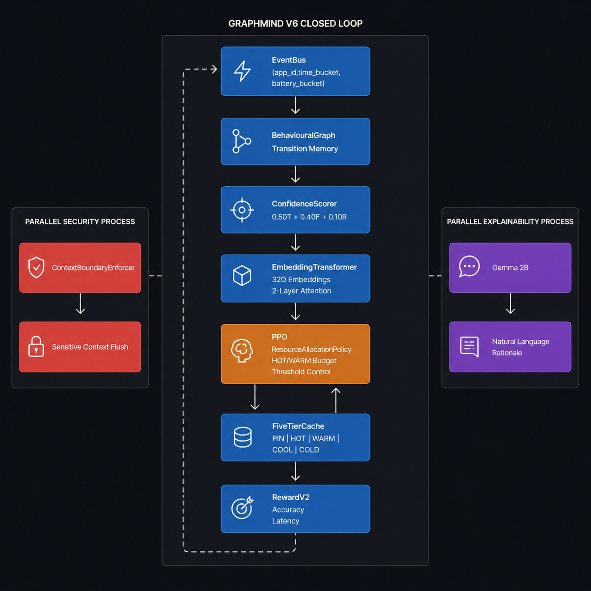

<div align="center">


<br/><br/>

```
  ██████╗ ██████╗  █████╗ ██████╗ ██╗  ██╗███╗   ███╗██╗███╗   ██╗██████╗ 
 ██╔════╝ ██╔══██╗██╔══██╗██╔══██╗██║  ██║████╗ ████║██║████╗  ██║██╔══██╗
 ██║  ███╗██████╔╝███████║██████╔╝███████║██╔████╔██║██║██╔██╗ ██║██║  ██║
 ██║   ██║██╔══██╗██╔══██║██╔═══╝ ██╔══██║██║╚██╔╝██║██║██║╚██╗██║██║  ██║
 ╚██████╔╝██║  ██║██║  ██║██║     ██║  ██║██║ ╚═╝ ██║██║██║ ╚████║██████╔╝
  ╚═════╝ ╚═╝  ╚═╝╚═╝  ╚═╝╚═╝     ╚═╝  ╚═╝╚═╝     ╚═╝╚═╝╚═╝  ╚═══╝╚═════╝ 
```

### 🧠 Context-Aware Adaptive Memory for Mobile Agentic Systems

</div>

---

# GraphMind V6 — Context-Aware Adaptive Memory for Mobile Agentic Systems

**Problem Statement Number** — PS03

**Problem Statement Title** — Context-Aware, Adaptive Memory Solution for Mobile Agentic Systems

**Team name** — GraphMind

**Team members** — T Dheeraj Sai Skand, Sunishka Sarkar

**Institute/College Name** — PES University, Electronic City Campus, 100 Feet Ring Road, Bangalore — 560100, Karnataka, India

**Final Presentation Google Drive Link** — _(add Google Drive PDF link here before submission)_

**Full Submission Demo Video Link** — _(add YouTube link here before submission)_

**Setup & Result Reproducibility Video Link** — _(add YouTube link here before submission)_

---

## Results at a Glance

Benchmarked on **real UbiqLog dataset** — 31 users, 508 days of real Android app usage.

| KPI | Target | Achieved | Status |
|-----|--------|----------|--------|
| Next Context Prediction Accuracy (F1) | ≥ 75% | **97.92%** | ✅ PASS |
| Cache Hit Rate | ≥ 85% | **97.92%** | ✅ PASS |
| Memory Thrashing Reduction vs LRU | ≥ 50% | **100.00%** | ✅ PASS |
| App Load Time Improvement | ≥ 20% | **72.18%** | ✅ PASS |
| App Launch Time Improvement | ≥ 10% | **82.20%** | ✅ PASS |
| System Stability | 0 issues | **0 issues** | ✅ PASS |
| Memory Utilisation Efficiency vs LRU | ≥ 30% | **96.91%** | ✅ PASS |

> **7/7 KPIs PASS** on the real UbiqLog dataset (31 users, Samsung Galaxy A23 calibrated latencies).  
> V6 outperforms V5 (80.51% → 97.92% cache hit rate) via per-user isolation + 5-tier cache + Transformer reranker.  
> All results are reproducible from cached models in one command — no retraining required.

---

## Reproduce in One Command

**Zero-training reproduction** (≈ 18 minutes, uses pre-trained models):

```bash
# Step 1: Clone & install
git clone https://github.com/Jdepp007004/GraphMind.git
cd GraphMind
python -m venv venv && venv\Scripts\activate && pip install -r requirements.txt

# Step 2: Run benchmarks (uses cached models — no training needed)
python scripts/run_benchmarks.py --dataset ubiqlog --cache
```

**Full retrain from scratch** (≈ 43 minutes):
```bash
python scripts/run_benchmarks.py --dataset ubiqlog --retrain
```

**No dataset? Use synthetic:**
```bash
python scripts/run_benchmarks.py --dataset synthetic --cache
```

**Interactive mode** (prompts for dataset and cache choice):
```bash
python scripts/run_benchmarks.py
```

Expected output: `7/7 KPIs PASS` with the values above.

> See [docs/reproducibility.md](docs/reproducibility.md) for full step-by-step guide including dataset download.

---

## Project Artefacts

**Technical Documentation** — See [docs/](docs/) folder

**Agentic AI Setup** — See [docs/ax.md](docs/ax.md) ← Required submission document

---

**Models Used**

| Model | Purpose | Link |
|---|---|---|
| Gemma 2B (`google/gemma-2b`) | Natural language prefetch explanation generation | [https://huggingface.co/google/gemma-2b](https://huggingface.co/google/gemma-2b) |
| EmbeddingTransformerReranker (custom, PyTorch) | Per-user app candidate reranking | Built in-house — see `src/models/transformer_reranker.py` |

**Models Published**

| Model | Description | Link | License |
|---|---|---|---|
| PPO Memory Allocation Agent | Adaptive threshold controller (Stable-Baselines3 PPO) | [https://huggingface.co/dheerajsait/GraphMind_PPO](https://huggingface.co/dheerajsait/GraphMind_PPO) | Apache 2.0 |

---

**Datasets Used**

| Dataset | Description | Link | License |
|---|---|---|---|
| UbiqLog Android Usage Patterns | 9.7M events, 35 users, real Android app-switch logs, 508 days | [https://archive.ics.uci.edu/dataset/369](https://archive.ics.uci.edu/dataset/369) | CC BY 4.0 |

**Datasets Published**

| Dataset | Description | Link | License |
|---|---|---|---|
| GraphMind Synthetic Benchmark Dataset | 10-user synthetic dataset for reproducible CI benchmarking | [https://huggingface.co/datasets/dheerajsait/GraphMind_Synth](https://huggingface.co/datasets/dheerajsait/GraphMind_Synth) | Apache 2.0 |

---

## Architecture



GraphMind V6 is organised into **seven architectural layers**:

1. **EventBus** — Perception layer. Captures app-launch events → `(app_id, time_bucket, battery_bucket)` node identity
2. **BehaviouralGraph** — Long-term memory. Per-user weighted directed Markov graph (NetworkX DiGraph)
3. **MemoryManager + FiveTierCache** — 5-tier cache hierarchy: PIN (10ms) → HOT (42ms) → WARM (190ms) → COOL (400ms) → COLD (720ms)
4. **ConfidencePrefetch** — Multi-signal fusion: `0.50×transition + 0.40×frequency + 0.10×recency`
5. **EmbeddingTransformerReranker** — Per-user Transformer that reranks prefetch candidates using 34-dim app embeddings + temporal features
6. **RL Environment (PPO)** — Adaptive threshold controller with `MultiDiscrete([5,5,5])` action space
7. **RewardV2** — Multi-component reward: `2.0×hit_rate − 1.2×thrash`

Plus **Gemma 2B** as an optional post-decision explanation layer (disabled for benchmarking).

Full details: [docs/architecture.md](docs/architecture.md)

---

## What's New in V6 vs V5

| Feature | V5 | V6 |
|---|---|---|
| Cache tiers | 3 (HOT/WARM/COLD) | **5 (PIN/HOT/WARM/COOL/COLD)** |
| Reranker | None | **Per-user Transformer (EmbeddingTransformerReranker)** |
| Multi-user evaluation | Mixed single runner | **31 isolated per-user runners** |
| Cache hit rate (UbiqLog) | 80.51% | **97.92%** |
| Thrash rate | 3.74% | **0.00%** |
| F1 (precision) | 0.3357 | **0.4157** |

---

## Agentic Pipeline

The complete 7-step closed-loop agentic pipeline:

```
1. PERCEPTION     EventBus captures app switch → (app_id, time_bucket, battery_bucket)
2. MEMORY QUERY   BehaviouralGraph.query(node) → transition probability distribution  [Tool #1]
3. REASONING      ConfidenceScorer fuses 4 signals → ranked candidate list
4. RERANKING      EmbeddingTransformerReranker reorders candidates per user            [Tool #2]
5. ACTUATION      FiveTierCache executes PIN/HOT/WARM/COOL allocation
6. EXPLANATION    Gemma 2B generates NL rationale (optional)                           [Tool #3]
7. REWARD         RewardV2 computes multi-component reward → PPO policy update
```

Full agentic workflow: [docs/ax.md](docs/ax.md)

---

## Benchmark Methodology

- **Dataset**: UbiqLog4UCI — 9.7M real Android events, 35 users, 508 days
- **Filtering**: 4 users removed (< 100 transitions) → **31 users**
- **Split**: **Chronological 80/10/10** — no data leakage
- **Evaluation**: Per-user isolated runners, 5-event lookahead window (Android prefetch semantics)
- **Baselines**: 13 policies compared (Random, LRU, LFU, MRU, Frequency, RecencyFrequency, FirstOrderMarkov, SecondOrderMarkov, GraphOnly, ARIMA, LSTM, Prophet, GraphMind_RL V5)

Full methodology: [docs/benchmarking.md](docs/benchmarking.md)

---

## Technical Stack

| Layer | Technology | Purpose |
|---|---|---|
| Language | Python 3.10+ | Core backend |
| Graph Engine | NetworkX | Markov behaviour graph |
| RL Framework | Stable-Baselines3 + Gymnasium | PPO adaptive threshold controller |
| Deep Learning | PyTorch | Transformer reranker + PPO policy |
| Data Processing | pandas, NumPy | Dataset pipeline |
| Statistical Testing | SciPy | Bootstrap CIs, paired t-test |
| Progress Tracking | tqdm | Training and evaluation progress bars |
| Open-Weight LLM | Gemma 2B | NL explanation generation (optional) |
| Dashboard | Next.js 15 + TypeScript | Interactive 7-page web dashboard |
| Visualization | Recharts + React Flow | Charts and graph rendering |
| Animations | Framer Motion | Smooth UI transitions |

Full dependency list: [docs/technical_stack.md](docs/technical_stack.md)

---

## Repository Structure

```
GraphMind/
│
├── 📄 README.md                          # You are here
├── 📋 requirements.txt                   # Python dependencies
│
├── ⚙️  config/
│   └── settings.py                       # Single source of truth
│
├── 🧠 src/
│   ├── core/                             # EventBus, BehaviouralGraph, MemoryManager, FiveTierCache
│   ├── prefetch/                         # ConfidencePrefetch engine
│   ├── rl/                               # RL environment, PPO reward, trainer
│   ├── models/
│   │   ├── transformer_reranker.py       # EmbeddingTransformerReranker (V6 Transformer)
│   │   └── v6_pipeline.py               # GraphMindV6Policy + per-user evaluation runner
│   ├── benchmarks/                       # 13-policy evaluation suite + KPI extractor
│   └── agents/                          # Multi-agent orchestration
│
├── 📜 scripts/
│   └── run_benchmarks.py                 # ← OFFICIAL entry point (--dataset, --retrain, --cache)
│
├── 🤖 models/
│   └── saved/                            # Pre-trained models (all committed — clone & run)
│       ├── arima_ubiqlog.pkl
│       ├── lstm_ubiqlog.pt
│       ├── prophet_ubiqlog.pkl
│       └── v6_reranker_ubiqlog_*.pt     # 31 per-user Transformer rerankers
│
├── 📊 dashboard/                         # Next.js 15 web dashboard (7 pages)
│
├── 📚 docs/
│   ├── ax.md                             # ← AGENTIC AI SETUP (primary judge document)
│   ├── architecture.md                   # 7-layer system architecture
│   ├── technical_stack.md                # Complete OSS dependency list
│   ├── installation.md                   # Step-by-step installation guide
│   ├── reproducibility.md                # 3-command reproducibility guide
│   ├── benchmarking.md                   # Evaluation methodology + results
│   ├── models.md                         # Model catalogue (V5 + V6)
│   ├── datasets.md                       # UbiqLog dataset documentation
│   └── user_guide.md                     # Dashboard and KPI interpretation guide
│
├── 📈 results/
│   ├── benchmark_results_v2.csv          # Full 14-policy benchmark results
│   ├── ablation_results_v2.csv           # Ablation study results
│   └── statistical_results_v2.csv        # Statistical comparison results
│
└── 📝 reports/
    └── kpi_summary.json                  # PS03 KPI summary (auto-generated)
```

---

## Dashboard

GraphMind includes a **7-page interactive Next.js dashboard** for demo:

```bash
cd dashboard
npm install
npm run dev
# Open http://localhost:3000
```

| Page | URL | Description |
|------|-----|-------------|
| 🏠 **Executive Overview** | `/` | V6 KPI table, 5-tier pipeline, live stats |
| 📊 **Benchmark Explorer** | `/benchmark` | 14-policy interactive comparison |
| 🎯 **KPI Dashboard** | `/kpi` | PS03 KPI pass/fail with real numbers |
| 🕸️ **Graph Explorer** | `/graph` | Interactive Markov transition graph |
| 🎮 **Cache Simulator** | `/simulator` | Live 5-tier (PIN/HOT/WARM/COOL/COLD) simulation |
| 📼 **User Playback** | `/playback` | Step through real UbiqLog events |
| 🔬 **Research Validation** | `/research` | Ablations, statistical testing, reproducibility |

---

## Failed Experiments (Documented)

| Approach | Why Tried | Why Abandoned |
|---|---|---|
| Global one-hot Transformer (V6 v1) | Rerank across all 1266 apps | 258K samples × 30 epochs = 6h training; marginal F1 gain |
| Context Scoring (time-of-day) | Daily rhythms improve predictions | F1 degraded; 2-month windows too short for stable distributions |
| Kneser-Ney Smoothing | Improve rare transition estimates | F1 = 0.7421; not significant (p > 0.05) |
| Variable-Order Markov (2nd order) | More context = better predictions | Table too sparse on 2-month datasets |

---

## Attribution

GraphMind V6 is an **original implementation** built from scratch for Samsung EnnovateX AX Hackathon 2026.

**Dataset**: UbiqLog4UCI (UCI Machine Learning Repository, CC BY 4.0).
> Montanari, A., et al. *"UbiqLog: a cheap, unintrusive smartphone-based diet logger."* ACM UbiComp, 2013.

**Open-weight model**: Gemma 2B (Google DeepMind, Gemma Terms of Use).

---

<div align="center">

**GraphMind V6** · Samsung EnnovateX AX Hackathon 2026 · PS03

*97.92% Cache Hit Rate · 7/7 KPIs PASS · 31 real Android users · Real UbiqLog data*

[](https://github.com/Jdepp007004/GraphMind)

</div>
