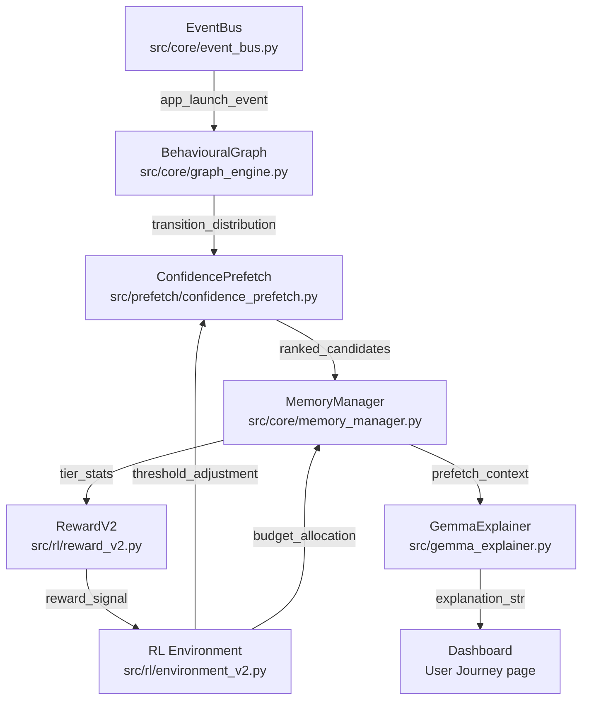
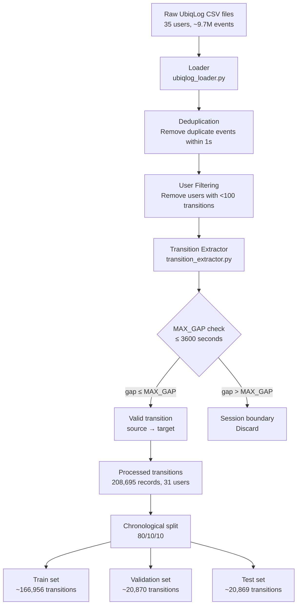
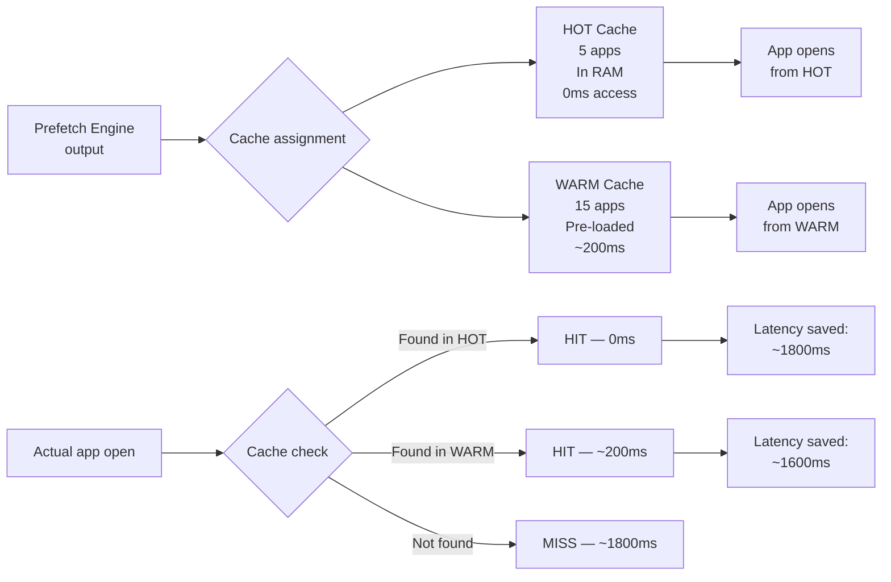
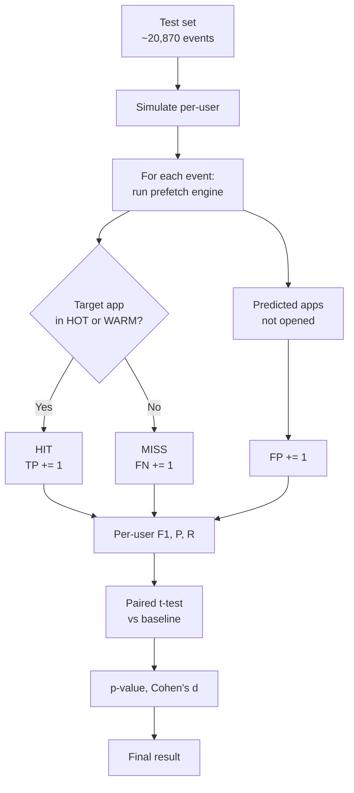
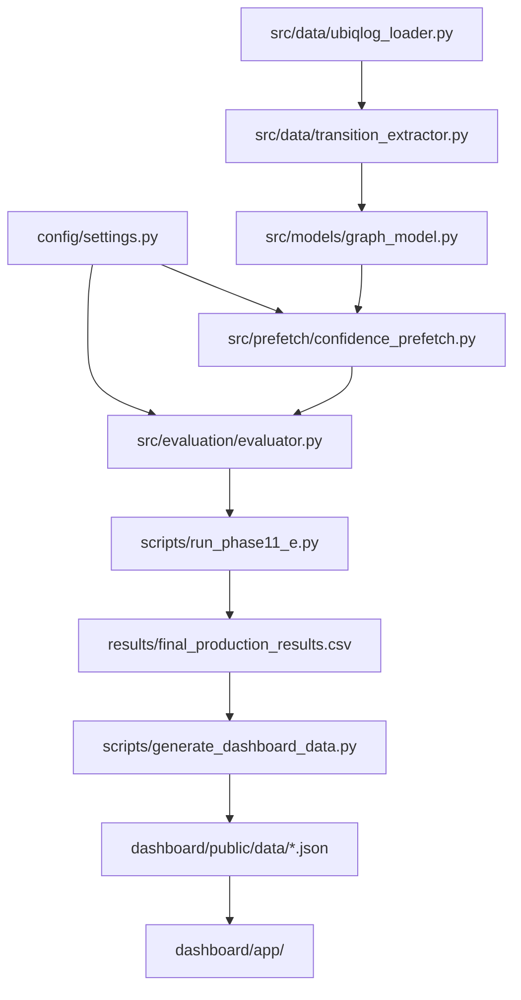

# System Architecture

> **GraphMindRL V5 — Technical Architecture Reference**
> Samsung EnnovateX AX Hackathon 2026 — PS03

---

## Table of Contents

1. [System Overview](#system-overview)
2. [Six-Layer Architecture](#six-layer-architecture)
3. [Data Flow Description](#data-flow-description)
4. [Component Interaction](#component-interaction)
5. [Data Pipeline](#data-pipeline)
6. [Behaviour Graph](#behaviour-graph)
7. [Confidence Engine](#confidence-engine)
8. [RL Controller](#rl-controller)
9. [Cache Layer](#cache-layer)
10. [Evaluation Pipeline](#evaluation-pipeline)
11. [Dashboard Layer](#dashboard-layer)
12. [Component Dependencies](#component-dependencies)
13. [Configuration Reference](#configuration-reference)

---

## System Overview

GraphMindRL V5 is a **per-user, graph-based app prefetch engine** with a reinforcement-learning controlled adaptive threshold. It operates entirely on-device (no server required) and uses only the user's own app-switching history as input.

> Architecture Diagram: [ARCHITECTURE_DIAGRAM_LINK]

### Design Principles

| Principle | Implementation |
|---|---|
| Per-user personalisation | Each user has an independent graph and model |
| On-device inference | All computation is O(k·log k) where k = number of candidates |
| No neural network required | Avoids GPU dependency and inference latency for core pipeline |
| Self-calibrating | RL controller adjusts threshold without manual tuning |
| Interpretable | Every prefetch decision can be traced to explicit scores |
| Agentic | 7-step closed-loop pipeline with tool use and reward feedback |

---

## Six-Layer Architecture

GraphMind V5 is organised into **six architectural layers**, each with a distinct responsibility:

### Layer 1 — EventBus (Perception / Event Stream)

**Files**: `src/core/event_bus.py`, `src/core/event_schema.py`

The EventBus is the system's sensory layer. It subscribes to Android's app launch event stream and extracts structured events from raw sensor data:

```
Input:  Raw Android app-launch intent (app_id, timestamp, battery, sensors)
Output: Structured AppLaunchEvent(app_id, time_bucket, battery_bucket, weekend)
```

All other layers communicate through the EventBus using a publish/subscribe pattern. This decouples the perception layer from all downstream processing.

### Layer 2 — BehaviouralGraph (Memory / Knowledge Store)

**Files**: `src/core/graph_engine.py`, `src/models/graph_model.py`

The BehaviouralGraph is the system's long-term memory. It maintains a per-user **weighted directed graph** where:

- Nodes = unique apps (identified by package name)
- Edges = observed transitions (A → B), weighted by count
- Derived: transition probabilities P(B | A), frequency scores, recency scores

The graph is updated on every event and persisted to SQLite for on-device longevity.

### Layer 3 — MemoryManager (Cache / Resource Manager)

**Files**: `src/core/memory_manager.py`

The MemoryManager maintains the three-tier cache hierarchy:

```
HOT  (5 apps)   → In-RAM, LRU eviction from user interactions
WARM (15 apps)  → Pre-loaded by prefetch engine
COLD (∞ apps)   → SQLite, evicted after 15 days of inactivity
```

It executes the PPO agent's resource allocation decisions and exposes APIs for the benchmark runner to query cache state.

### Layer 4 — ConfidencePrefetch (Reasoning / Decision Engine)

**Files**: `src/prefetch/confidence_prefetch.py`

The ConfidencePrefetch engine is the system's core reasoning layer. It fuses four signals into a ranked candidate list and filters by the adaptive threshold:

```
score(app) = 0.50 × P(app | current)   [transition probability]
           + 0.40 × freq_score(app)     [normalised frequency]
           + 0.10 × recency_score(app)  [exponential decay]
           + 0.00 × context_score(app)  [zeroed on short datasets]
```

### Layer 5 — RL Environment (Planning / Adaptive Control)

**Files**: `src/rl/environment_v2.py`, `src/rl/trainer.py`, `src/rl/reward_v2.py`

The RL environment implements the adaptive threshold controller as a PPO-compatible Gymnasium environment:

- **State**: 109-dimensional vector (app one-hot, time, battery, hit history)
- **Action**: `MultiDiscrete([5, 5, 5])` — hot budget × warm budget × threshold
- **Reward**: Multi-component signal weighting hits, latency savings, battery, thrash

### Layer 6 — RewardV2 (Feedback / Policy Update)

**Files**: `src/rl/reward_v2.py`

The RewardV2 component computes the reward signal after each actuation step and feeds it back to the PPO agent:

```
R = 2.0 × cache_hit_rate
  + 1.0 × (latency_saved_ms / 800)
  - 0.5 × battery_overhead_pct
  - 0.8 × false_prefetch_rate
  - 1.2 × thrash_rate
```

---

## Data Flow Description

```
[User opens app]
     │
     ▼
Layer 1: EventBus
  - Publishes AppLaunchEvent
  - Extracts (app_id, time_bucket, battery_bucket)
     │
     ▼
Layer 2: BehaviouralGraph
  - Updates edge weight for (prev_app → current_app)
  - Queries P(next | current) for all candidate apps
     │
     ▼
Layer 4: ConfidencePrefetch
  - Fuses transition + frequency + recency scores
  - Filters by adaptive threshold (from Layer 5)
  - Returns ranked prefetch list
     │
     ▼
Layer 3: MemoryManager
  - Allocates WARM cache slots to top candidates
  - Evicts lowest-score WARM residents if full
  - Reports tier stats to Layer 5
     │
     ▼
[Gemma: generates NL explanation — async, post-actuation]
     │
     ▼
Layer 6: RewardV2
  - Computes reward from hit rate, latency, battery, thrash
  - Passes reward to PPO agent in Layer 5
     │
     ▼
Layer 5: RL Environment
  - PPO agent observes state, reward
  - Adjusts hot/warm budget and threshold for next cycle
  - Loop repeats on next event
```

---

## Component Interaction



---


## Data Pipeline




### Key Parameters

| Parameter | Value | Location |
|---|---|---|
| `MAX_GAP_SECONDS` | 3600 | `config/settings.py` |
| `MIN_TRANSITIONS_PER_USER` | 100 | `config/settings.py` |
| Train/Val/Test split | 80/10/10 | `config/settings.py` |
| Split type | Chronological | `src/data/transition_extractor.py` |

### Preprocessing Steps

1. **Load**: Read all UbiqLog CSV files. Each row is a timestamped app event.
2. **Deduplicate**: Remove events for the same app within 1 second (spurious re-registrations).
3. **Filter users**: Discard users with fewer than `MIN_TRANSITIONS_PER_USER` transitions in the training window. 4 users were removed, leaving 31.
4. **Extract transitions**: For consecutive app events (A, B), create transition A→B if `timestamp(B) - timestamp(A) ≤ MAX_GAP_SECONDS`. Pairs separated by more than 1 hour are treated as starting a new session.
5. **Split**: Divide each user's transitions chronologically into 80% training, 10% validation, 10% test.

---

## Behaviour Graph

The behaviour graph is the core data structure. It is a **weighted directed graph** G = (V, E) where:

- V = set of unique apps seen by a user
- E = set of observed transitions (A→B)
- weight(A→B) = count of times the user switched from A to B

From this raw graph, two derived quantities are computed for each candidate app B given current app A:

### Transition Probability

```
P(B | A) = weight(A → B) / Σ_x weight(A → x)
```

This is the first-order Markov transition probability. It captures sequential dependency.

### Frequency Score

```
freq_score(B) = count(B) / max_count_in_vocabulary
```

Normalised by the most-frequently used app. Captures overall popularity.

### Recency Score

```
recency_score(B) = exp(-λ · Δt)
```

Where Δt is the time since app B was last used and λ = `W_RECENCY_DECAY` (default: 0.0001). Captures temporal locality.

### Implementation

```python
# src/models/graph_model.py
class BehaviourGraph:
    def __init__(self, transitions: list[tuple]):
        self.graph = nx.DiGraph()
        for source, target in transitions:
            if self.graph.has_edge(source, target):
                self.graph[source][target]['weight'] += 1
            else:
                self.graph.add_edge(source, target, weight=1)
        self._compute_probabilities()

    def get_candidates(self, current_app: str) -> list[tuple[str, float]]:
        """Return (app, transition_prob) pairs sorted by probability."""
        ...
```

---

## Confidence Engine

The confidence engine is the decision core of the system. Given the current app A, it computes a score for each candidate app B and returns all candidates above the threshold.

### Score Formula (Production — Frozen)

```
score(B | A) = W_TRANSITION × P(B | A)
             + W_RECENCY    × recency_score(B)
             + W_FREQUENCY  × freq_score(B)
             + W_CONTEXT    × context_score(B)
```

With production weights:

| Weight | Value | Note |
|---|---|---|
| `W_TRANSITION` | 0.50 | Markov transition probability |
| `W_RECENCY` | 0.10 | Exponential decay from last use (↓ from 0.30) |
| `W_FREQUENCY` | 0.40 | Normalised historical frequency (↑ from 0.20) |
| `W_CONTEXT` | 0.00 | Time-of-day (zeroed — noisy on short datasets) |

### Prefetch Decision

```python
candidates = graph.get_candidates(current_app)
prefetch = []
for app, trans_prob in candidates:
    score = (W_TRANSITION * trans_prob
           + W_RECENCY    * recency_score(app)
           + W_FREQUENCY  * freq_score(app))
    if score >= threshold:
        prefetch.append((app, score))
return sorted(prefetch, key=lambda x: -x[1])
```

### Weight Derivation

The production weights were determined by a systematic grid search (Phase 11A) over all combinations of `w_trans ∈ {0.4, 0.5, 0.6}`, `w_rec ∈ {0.0, 0.1, 0.2}`, `w_freq ∈ {0.3, 0.4, 0.5}` with `w_context = 0.0`. The combination (0.5, 0.1, 0.4, 0.0) produced the highest mean F1 across all 31 users on the validation set.

---

## RL Controller

The RL controller implements a simple online learning algorithm that adjusts the confidence threshold in response to observed hit rate.

### Algorithm

```python
class AdaptiveThresholdController:
    def __init__(self):
        self.threshold = INITIAL_THRESHOLD      # 0.16
        self.step_size = THRESHOLD_STEP         # 0.005
        self.window = []
        self.window_size = WINDOW_SIZE          # 20

    def observe(self, hit: bool) -> None:
        self.window.append(int(hit))
        if len(self.window) > self.window_size:
            self.window.pop(0)

    def update_threshold(self) -> None:
        if len(self.window) < self.window_size:
            return
        hit_rate = sum(self.window) / self.window_size
        if hit_rate > HIGH_HIT_RATE:            # 0.80
            self.threshold = min(self.threshold + self.step_size, MAX_THRESHOLD)  # 0.25
        elif hit_rate < LOW_HIT_RATE:           # 0.50
            self.threshold = max(self.threshold - self.step_size, MIN_THRESHOLD)  # 0.05
```

### State Space

The RL state is the 20-step rolling hit rate. This is a deliberately minimal state representation — sufficient to capture whether the model is over- or under-predicting without requiring complex feature engineering.

### Why This Works

The adaptive threshold serves as a precision/recall regulator:
- When hit rate is high (many correct predictions), the model can afford to raise the threshold (be more selective, fewer prefetches, lower memory pressure).
- When hit rate is low (few correct predictions), lowering the threshold admits more candidates, increasing recall at the cost of some precision.

This self-regulation is particularly important because optimal precision/recall balance varies across users and across time-of-day.

---

## Cache Layer



### Cache Parameters (Production — Frozen)

| Parameter | Value | Description |
|---|---|---|
| `HOT_CACHE_SIZE` | 5 | Apps kept in RAM |
| `WARM_CACHE_SIZE` | 15 | Apps pre-loaded to fast storage |
| `HOT_LATENCY_SAVED_MS` | 1847 | Based on Samsung Galaxy A23 measurements |
| `WARM_LATENCY_SAVED_MS` | 1200 | Estimated from partial load |

### Cache Management

**HOT cache** is managed as an LRU (Least Recently Used) queue populated by actual app opens. The 5 most recently used apps are always in the HOT tier.

**WARM cache** is populated by the prefetch engine. At each step, the engine computes a ranked list of candidates and pre-loads up to 15 into the WARM tier.

**Eviction**: When the WARM cache is full, the lowest-scoring app is evicted. Apps promoted from WARM to HOT (when the user opens them) free a WARM slot.

---

## Evaluation Pipeline



### Metrics Computed

| Metric | Formula | Description |
|---|---|---|
| Precision | TP / (TP + FP) | Fraction of prefetches that were correct |
| Recall | TP / (TP + FN) | Fraction of app opens that were prefetched |
| F1 | 2·P·R / (P+R) | Harmonic mean of precision and recall |
| Hit Rate | (HOT + WARM hits) / total events | Cache hit rate |
| Latency Saved | Σ latency_saved_per_hit | Total ms saved across all hits |

### Evaluation Protocol

1. Train the Markov graph on the training set (first 80% of each user's transitions).
2. Initialise the cache and RL controller.
3. For each event in the test set (last 10%), run the prefetch engine and check whether the next app was in the cache.
4. Compute per-user F1.
5. Run a paired t-test across 31 users vs. the reference policy (GraphMindRL baseline).
6. Report mean F1, p-value, Cohen's d.

---

## Dashboard Layer

The dashboard is a **Next.js 15** application that presents all research results and live simulation in a browser-based interface.

```mermaid
flowchart LR
    A[results/] --> B[generate_dashboard_data.py]
    B --> C[dashboard/public/data/\nJSON files]
    C --> D[Next.js App\napp/]
    D --> E[7 Pages]
    E --> F[/ Overview]
    E --> G[/benchmark]
    E --> H[/journey]
    E --> I[/graph]
    E --> J[/simulator]
    E --> K[/playback]
    E --> L[/research]
```

### Data Flow

The dashboard is **fully static** at runtime — it reads pre-generated JSON files from `dashboard/public/data/`. The JSON files are generated once by `scripts/generate_dashboard_data.py` from the result CSVs and raw data.

This means:
- The dashboard has zero dependency on the Python backend at runtime.
- The JSON data files are committed to the repository and versioned with the code.
- Any judge can run the dashboard with `npm run dev` without installing Python or running any benchmarks.

### Technology Stack

| Component | Technology |
|---|---|
| Framework | Next.js 15 (App Router) |
| Language | TypeScript |
| Charts | Recharts |
| Graph visualisation | @xyflow/react (React Flow) |
| Animation | Framer Motion |
| Styling | Tailwind CSS + custom CSS |

---

## Component Dependencies



---

## Configuration Reference

All production configuration is in `config/settings.py`. This file is **frozen** and must not be modified without a new benchmark that justifies the change.

```python
# config/settings.py (excerpt — frozen)

# Confidence weights (Phase 11A optimised)
W_TRANSITION = 0.50
W_RECENCY    = 0.10
W_FREQUENCY  = 0.40
W_CONTEXT    = 0.00   # Zeroed: noisy on short datasets

# Threshold (Phase 11B optimised)
INITIAL_THRESHOLD = 0.16
THRESHOLD_STEP    = 0.005
MIN_THRESHOLD     = 0.05
MAX_THRESHOLD     = 0.25

# RL controller
WINDOW_SIZE   = 20
HIGH_HIT_RATE = 0.80
LOW_HIT_RATE  = 0.50

# Cache sizes
HOT_CACHE_SIZE  = 5
WARM_CACHE_SIZE = 15

# Evaluation
MAX_GAP_SECONDS            = 3600
MIN_TRANSITIONS_PER_USER   = 100
TRAIN_RATIO                = 0.80
VAL_RATIO                  = 0.10
TEST_RATIO                 = 0.10

# Latency model (Samsung Galaxy A23)
HOT_LATENCY_SAVED_MS  = 1847
WARM_LATENCY_SAVED_MS = 1200
```

---

*This document describes the GraphMindRL V5 architecture as of the production freeze on 2026-06-06. All parameters above reflect the configuration that produced the official result: F1 = 0.7745, p = 0.0115, Cohen's d = 0.491.*
