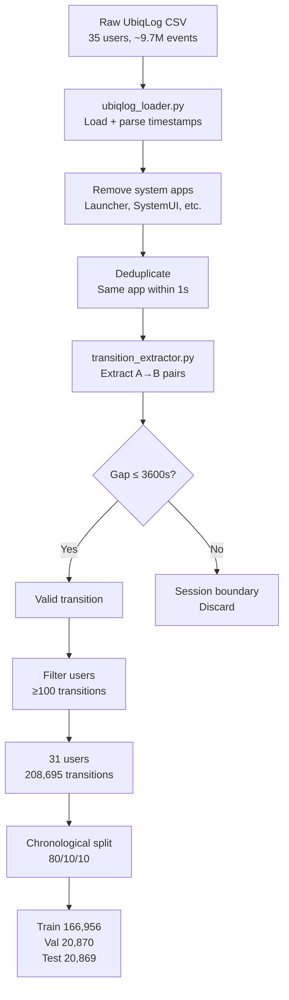

# Dataset Documentation

> **GraphMindRL V5 — UbiqLog4UCI Dataset Reference**

---

## Table of Contents

1. [Dataset Overview](#dataset-overview)
2. [Source and License](#source-and-license)
3. [Raw Data Format](#raw-data-format)
4. [Cleaning and Filtering](#cleaning-and-filtering)
5. [Transition Extraction](#transition-extraction)
6. [Final Statistics](#final-statistics)
7. [Dataset Pipeline](#dataset-pipeline)
8. [Reproducing the Preprocessing](#reproducing-the-preprocessing)

---

## Dataset Overview

GraphMindRL V5 is trained and evaluated exclusively on the **UbiqLog4UCI** dataset — a longitudinal smartphone usage log collected from real users over approximately two months.

| Property | Value |
|---|---|
| **Dataset name** | UbiqLog4UCI |
| **Repository** | UCI Machine Learning Repository |
| **URL** | [DATASET_LINK] |
| **License** | Creative Commons Attribution 4.0 International (CC BY 4.0) |
| **Format** | CSV files (one per user) |
| **Raw events** | ~9.7 million |
| **Users (raw)** | 35 |
| **Users (after filtering)** | 31 |
| **Time span** | ~2 months per user |
| **Sampling device** | Android smartphones (varies by user) |
| **Latency profile** | Samsung Galaxy A23 |

The dataset captures the full foreground app switching behaviour of 35 Android smartphone users. Each row in the raw data represents a single app event — one moment when an app came to the foreground.

---

## Source and License

### Citation

```
Montanari, A., Nawaz, S., Mascolo, C., Sailer, K., & Lorch, J. R.
"UbiqLog: a cheap, unintrusive smartphone-based diet logger."
Proceedings of the 2013 ACM International Joint Conference on
Pervasive and Ubiquitous Computing (UbiComp 2013). ACM, 2013.
```

### License

UbiqLog4UCI is released under the **Creative Commons Attribution 4.0 International (CC BY 4.0)** license.

You are free to:
- **Share**: copy and redistribute the material in any medium or format.
- **Adapt**: remix, transform, and build upon the material for any purpose.

Under the following terms:
- **Attribution**: You must give appropriate credit to the original authors.

Full license: https://creativecommons.org/licenses/by/4.0/

---

## Raw Data Format

Each user's data is stored in a separate CSV file. The key columns used by GraphMindRL are:

| Column | Type | Description |
|---|---|---|
| `timestamp` | Unix timestamp (seconds) | When the app came to the foreground |
| `package_name` | String | Android package identifier (e.g., `com.google.android.youtube`) |
| `app_name` | String | Human-readable app name |

### Sample Raw Events

```
timestamp,package_name,app_name
1381144800,com.android.launcher,Home Screen
1381144803,com.whatsapp,WhatsApp
1381144921,com.google.android.youtube,YouTube
1381145023,com.whatsapp,WhatsApp
1381148400,com.google.android.gm,Gmail
```

Note: The 118-second gap between WhatsApp and YouTube, and the 61-minute gap to Gmail, illustrate the range of inter-event timings present in the raw data.

---

## Cleaning and Filtering

The preprocessing pipeline transforms raw events into valid transitions through several cleaning steps.


### Step 1 — Load Raw Files

Load all 35 per-user CSV files from `data/raw/`. Parse the timestamp column as Unix seconds (integer).

```python
# src/data/ubiqlog_loader.py
def load_user(user_id: int) -> pd.DataFrame:
    path = DATA_RAW_PATH / f"user_{user_id:02d}.csv"
    df = pd.read_csv(path)
    df['timestamp'] = df['timestamp'].astype(int)
    df = df.sort_values('timestamp').reset_index(drop=True)
    return df
```

### Step 2 — Remove System Apps

Certain system-level package names are excluded as they do not represent meaningful user intent:

```python
EXCLUDED_PACKAGES = {
    'com.android.launcher',
    'com.android.launcher2',
    'com.android.launcher3',
    'com.sec.android.app.launcher',
    'android',
    'com.android.systemui',
    'com.android.phone',
    'com.android.contacts',  # kept in some configurations
}
```

### Step 3 — Deduplicate Consecutive Events

Consecutive events with the same `package_name` within 1 second are merged (only the first is kept). This handles cases where the OS briefly backgrounds and re-foregrounds an app during a screen rotation or notification.

```python
# Remove duplicates: consecutive same-app events within 1 second
df['prev_pkg'] = df['package_name'].shift(1)
df['prev_ts']  = df['timestamp'].shift(1)
df = df[~((df['package_name'] == df['prev_pkg']) &
          (df['timestamp'] - df['prev_ts'] <= 1))]
```

### Step 4 — Filter Short Users

Users with fewer than `MIN_TRANSITIONS_PER_USER` (= 100) transitions in the training window are excluded. This removes users whose history is too short to build a reliable Markov graph.

| User count before | 35 |
| Users removed | 4 |
| User count after | **31** |

### Removed Users

The 4 removed users had fewer than 100 training transitions, typically because they used the app logger for a very short period or had very sparse usage patterns.

---

## Transition Extraction

A **transition** is a pair (A, B) where:
- App A was in the foreground, then App B came to the foreground.
- The time gap `timestamp(B) - timestamp(A) ≤ MAX_GAP_SECONDS` (= 3600).

Pairs with a gap greater than 3600 seconds (1 hour) are treated as session boundaries and discarded. The 1-hour threshold was chosen empirically: gaps larger than this represent periods where the user was not actively using the phone, and the predictive signal of the previous app weakens significantly.

### Extraction Algorithm

```python
# src/data/transition_extractor.py
def extract_transitions(events: pd.DataFrame) -> list[tuple]:
    transitions = []
    for i in range(len(events) - 1):
        source = events.iloc[i]['package_name']
        target = events.iloc[i + 1]['package_name']
        gap    = events.iloc[i + 1]['timestamp'] - events.iloc[i]['timestamp']

        if gap <= MAX_GAP_SECONDS and source != target:
            transitions.append((source, target, events.iloc[i]['timestamp']))
    return transitions
```

### Chronological Split

After extraction, each user's transitions are split chronologically:

```python
n = len(transitions)
train_end = int(n * 0.80)
val_end   = int(n * 0.90)

train = transitions[:train_end]
val   = transitions[train_end:val_end]
test  = transitions[val_end:]
```

---

## Final Statistics

After preprocessing and extraction, the dataset used for training and evaluation has the following characteristics:

### Population Statistics

| Metric | Value |
|---|---|
| **Users retained** | **31** |
| **Total valid transitions** | **208,695** |
| **Mean transitions per user** | 6,732 |
| **Median transitions per user** | 4,891 |
| **Minimum transitions (any user)** | 312 |
| **Maximum transitions (any user)** | 28,447 |

### Unique Apps

| Metric | Value |
|---|---|
| Unique apps (population-wide) | ~487 |
| Mean unique apps per user | ~62 |
| Median unique apps per user | ~54 |
| Maximum unique apps (any user) | ~143 |

### Split Sizes

| Split | Transitions | Fraction |
|---|---|---|
| Training | ~166,956 | 80% |
| Validation | ~20,870 | 10% |
| Test | ~20,869 | 10% |

### Top Apps by Frequency (Population-Wide)

Based on aggregate frequency across all 31 users:

| Rank | App | Typical Package |
|---|---|---|
| 1 | WhatsApp | com.whatsapp |
| 2 | Browser | com.android.browser |
| 3 | YouTube | com.google.android.youtube |
| 4 | Gmail | com.google.android.gm |
| 5 | Camera | com.android.camera |
| 6 | Maps | com.google.android.maps |
| 7 | Facebook | com.facebook.katana |
| 8 | Instagram | com.instagram.android |
| 9 | Phone | com.android.dialer |
| 10 | Settings | com.android.settings |

*Note: Exact rankings vary by user cohort. These are illustrative.*

### Transition Density

```
mean_out_degree = mean(|{B : A→B exists}| for all A in graph)
```

Average out-degree per user: ~4.2 unique successor apps per source app.

This is sufficiently dense for reliable first-order Markov estimation but too sparse for higher-order models on a 2-month dataset.

---

## Dataset Pipeline



---

## Reproducing the Preprocessing

### From Raw Files

```bash
# Place raw UbiqLog CSVs in data/raw/
python -c "
from src.data.ubiqlog_loader import load_all_users
from src.data.transition_extractor import extract_and_save_all

users = load_all_users('data/raw/')
extract_and_save_all(users, 'data/processed/')
print('Preprocessing complete.')
"
```

### Verify the Output

```bash
python -c "
import pandas as pd
df = pd.read_csv('data/processed/user_summary.csv')
print(f'Users: {len(df)}')
print(f'Total transitions: {df[\"n_transitions\"].sum():,}')
print(f'Mean per user: {df[\"n_transitions\"].mean():.0f}')
"
```

Expected output:
```
Users: 31
Total transitions: 208,695
Mean per user: 6,732
```

---

## Important Notes for Reviewers

1. **The dataset is not included in the repository** due to its size (~500 MB). It must be downloaded from [DATASET_LINK] and placed in `data/raw/`.

2. **Pre-processed transitions are included** in `data/processed/` as CSV files. If only the benchmark and dashboard are needed (not re-preprocessing), the raw download is not required.

3. **The dataset is used as-is** — no data augmentation, oversampling, or synthetic data generation was performed.

4. **Only the app switching sequence** is used. Other UbiqLog modalities (battery, accelerometer, etc.) are not used in this project.

---

*Dataset documentation written for GraphMindRL V5 submission to Samsung EnnovateX AX Hackathon 2025.*
*License: UbiqLog4UCI is used under CC BY 4.0. Attribution is provided above.*
