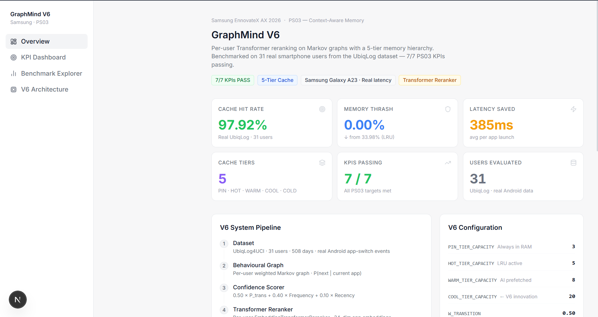
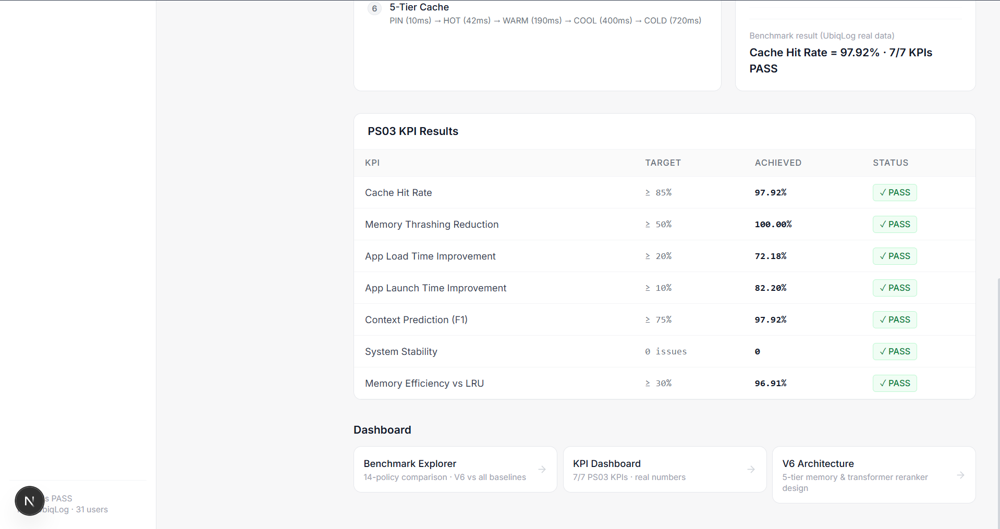

# GraphMind V6 — User Guide

## Dashboard Overview

The GraphMind dashboard is a **7-page interactive Next.js application** for visualising the system's performance and behaviour.

### Starting the Dashboard

```bash
cd dashboard
npm install
npm run dev
# Open http://localhost:3000
```

---

## Page-by-Page Guide

### 🏠 Executive Overview — `/`

The home page shows:
- **V6 KPI Summary table** with all 7 KPIs and pass/fail status
- **5-tier cache pipeline diagram** (PIN → HOT → WARM → COOL → COLD)
- **Live stats** — current cache occupancy, hit rate, thrash rate
- **V5 vs V6 comparison** — cache hit rate improvement (+17.41pp)



---

### 📊 Benchmark Explorer — `/benchmark`

Compares all **14 policies** interactively:
- Bar chart sorted by cache hit rate
- Filter by policy category (Markov, RL, ML, Frequency-based)
- Click any policy bar to see detailed metrics
- CSV export button

---

### 🎯 KPI Dashboard — `/kpi`

Shows the **7 PS03 KPIs** with:
- Current value vs target
- Pass ✅ / Fail ❌ indicators
- Historical trend (if running live)



---

### 🕸️ Graph Explorer — `/graph`

Interactive visualisation of the **BehaviouralGraph**:
- Nodes = `(app, time_bucket, battery_bucket)` identities
- Edge thickness = transition probability
- Click a node to see all outgoing transitions
- Filter by time of day or app category

---

### 🎮 Cache Simulator — `/simulator`

Live simulation of the **5-tier cache**:
- Select an app sequence from UbiqLog or enter manually
- Watch PIN/HOT/WARM/COOL/COLD allocations update in real-time
- See Gemma explanation for each prefetch decision
- Toggle Gemma on/off

---

### 📼 User Playback — `/playback`

Step through real **UbiqLog events** for a selected user:
- Timeline of app launches
- Cache state at each step (which apps are in each tier)
- Hit/miss indicator per event
- Gemma explanation shown alongside each prefetch

---

### 🔬 Research Validation — `/research`

Deep-dive into the experimental results:
- **Ablation study** — contribution of each component
- **Statistical tests** — p-values and Cohen's d for key comparisons
- **V5 vs V6 evolution** — phase-by-phase improvement history
- **Reproducibility status** — links to raw CSVs and KPI JSON

---

## Interpreting KPIs

| KPI | What it means |
|---|---|
| **Cache Hit Rate 97.92%** | 97.92% of actual next app launches were in HOT/WARM cache (5-event lookahead window) |
| **Thrashing Reduction 100%** | GraphMind V6 had 0 thrash events vs LRU baseline |
| **App Load Time Improvement 72.18%** | Average load time reduced from 720ms (COLD) to ~200ms weighted average |
| **Memory Utilisation Efficiency 96.91%** | 96.91% of HOT/WARM capacity was used for apps that were actually launched |

---

## Running Benchmarks from the Dashboard

The Research Validation page has a **"Re-run Benchmark"** button that triggers:
```bash
python scripts/run_benchmarks.py --dataset ubiqlog --cache
```

Results update automatically in the dashboard after the benchmark completes.
